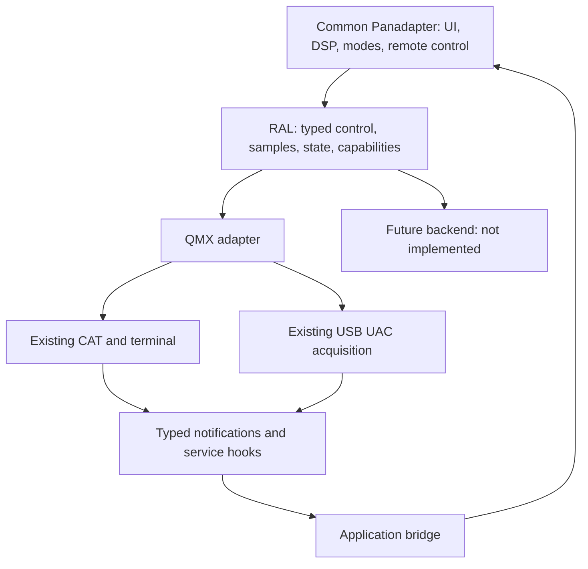

# qmx-panadapter: Radio Abstraction Layer analysis and refactoring plan

Analysis date: 16 September 2026. Repository: **pd4hs/qmx-panadapter**, default branch `main`, commit **ea022a8b51b1216df8df4c187b25e0ef77c07cb0**. Upstream `SteffenLav/qmx-panadapter/main` resolved to the same commit during this review. Findings and line numbers refer to this pinned snapshot, not subsequent upstream changes.

**Recommendation:** add a thin, typed RAL and a QMX adapter around the existing CAT/audio implementations. Keep their working transport, polling, parsing, buffering and recovery algorithms in place. Replace outbound application dependencies mechanically, but treat TX commands, signal geometry, radio menus and persistent PA configuration as explicit semantic boundaries. Simply wrapping frequency and mode setters will not make the application backend independent.

**No source files were changed; no commits, pushes, flashing or hardware actions were performed.** This report is outside the inspection checkout. This is a static architectural analysis, not a hardware certification that a proposed refactor preserves behavior.

## 1. Scope and evidence

The complete tracked tree was inventoried, including `main`, bundled components, tests/reference recordings, build/dependency configuration, tools/patches, documentation, release notes and packaged binaries. Application headers and implementation dependencies were scanned across the tree; the transport, CAT parser/handshake, recovery, UI mapping, DSP capture, digital TX and WSPR PA paths were examined directly. Appendices enumerate application files, actual CAT/audio symbol references and direct transport call sites. Binary artifacts were classified, not reverse engineered. This is not a claim that every decoder, crypto implementation or generated font was audited for correctness. **External-content limitation:** `test/wav_reference_full/temp_repo` is a gitlink (mode 160000) pinned to `9fec6ca39886edbf96f4f5e71edc76da5074e871`, with no tracked `.gitmodules` URL. Its contents are not supplied by this checkout and were not analyzed. It is a test-tree reference, not a registered application source in `main/CMakeLists.txt`. Managed dependency implementations and SDK-tree patches are likewise external; their declarations, bundled portions and patch tooling were inspected, but a full SDK audit is outside this repository analysis.

`CLAUDE.md` and architecture documentation provide important failure history, but the current source is authoritative: several comments describe older task placement, polling periods or retired features. In particular, current WSPR code retires automatic new PA reductions while retaining restoration of old persistent state. Do not revive a retired guard while abstracting it.

Source anchors:

- [Pinned fork](https://github.com/pd4hs/qmx-panadapter/tree/ea022a8b51b1216df8df4c187b25e0ef77c07cb0)
- [CAT public contract](https://github.com/pd4hs/qmx-panadapter/blob/ea022a8b51b1216df8df4c187b25e0ef77c07cb0/main/cat/cat.h)
- [CAT implementation](https://github.com/pd4hs/qmx-panadapter/blob/ea022a8b51b1216df8df4c187b25e0ef77c07cb0/main/cat/cat.c)
- [Audio implementation](https://github.com/pd4hs/qmx-panadapter/blob/ea022a8b51b1216df8df4c187b25e0ef77c07cb0/main/audio/audio.c)
- [DSP implementation](https://github.com/pd4hs/qmx-panadapter/blob/ea022a8b51b1216df8df4c187b25e0ef77c07cb0/main/dsp/dsp.c)
- [FT8/FT4 TX](https://github.com/pd4hs/qmx-panadapter/blob/ea022a8b51b1216df8df4c187b25e0ef77c07cb0/main/ft8_tx.c)
- [WSPR RX and PA configuration](https://github.com/pd4hs/qmx-panadapter/blob/ea022a8b51b1216df8df4c187b25e0ef77c07cb0/main/wspr_rx.c)

## 2. Every direct QMX communication boundary

| File | Direct communication or physical control | Refactoring treatment |
|---|---|---|
| `main/cat/cat.c` | CDC driver installation, first CDC interface open, line coding/control lines, RX callbacks/queue/parser, all CAT writes, extra-port probes, terminal probe, descriptor dump, orderly CDC close | Existing QMX implementation; retain paths and public `cat_*` symbols. Introduce narrow event/service hooks for calls into application code. |
| `main/audio/audio.c` | UAC install/event handling; audio input open, descriptor alternate parameters, stream start/read/stop/close; packed 24-bit decoding | Existing QMX acquisition implementation. Retain buffering, conversion and recovery. Replace UI reset call with a hook; expose through RAL. |
| `main/qmx_term.c` | **Separate direct CDC owner**, interface 5; open/read/write/control lines/close, ANSI terminal handling and exit walk | QMX optional backend extension. It is not covered by wrapping `cat.c`. Preserve implementation, make application access capability gated. |
| `main/util/usb_replug.c` | Logical root-port and physical VBUS cycling via USB/BSP; stale enumeration watchdog | QMX/USB recovery helper, not a generic radio reconnection policy. Keep behavior; start only for the QMX backend. |
| `main/util/usb_shutdown.c` | CAT safe stop, UAC alt-0 stop, logical root-port off, FT8 disarm | Separate application disarm from backend shutdown; dispatch QMX sequence through RAL. Preserve USB host cleanup for non-radio peripherals. |
| `main/util/gpio_relay.c` | GPIO relay pulse/power-cycle state machine; CAT readiness used as success criterion | Board helper with radio coupling; replace success test by RAL readiness or supplied predicate, capability gate radio power-cycle action. |
| `main/main.c` | Starts BSP USB host and QMX stale-device watchdog, audio and CAT in an important order | Composition root selects QMX backend. USB host also serves HID and cannot automatically become radio-only initialization. |

Bundled `components/espressif__usb_host_uac` performs actual UAC/USB transfers underneath `audio.c`; `components/m5stack_tab5` owns board USB power/host facilities. CDC is a managed dependency declared in `main/idf_component.yml`, with required external/managed patches checked by the build. USB HID files communicate with mouse peripherals, not with QMX; do not route HID through RAL.

### CAT/CDC details to preserve

- QMX VID/PID selection; CDC primary interface 0, 38400 baud, 8N1; second terminal interface 5 and noncontiguous extra interfaces. `qmx_term.c` duplicates identifiers deliberately. Do not assume serial interfaces are adjacent.
- RX callback delivery and bounded queue/processing context, ownership of shared CDC handles, disconnect waiting and close toleration. No new blocking callback, suspension or lock ordering.
- FA/MD/FW observation and refresh, Q9 IQ enable/readback/retries, Q3 VOX disable/readback, VN firmware query, menu-manager queries/writes, band/filter/gain configuration, TB decoded CW, RIT and split/VFO behavior, TM clock/GPS queries, PC/SW telemetry, TA/TX/RX stop recovery.
- Shared 200 ms setter rate limit and forced-frequency exception; deferred last-write-wins requests versus immediate sends; TX cooperative polling pause versus separate operator pause.
- MM writes are not ordinary volatile controls. EEPROM and `MU;` configuration reload semantics and subsequent Q9 reassertion must stay in QMX code.
- Readiness is currently set by parsed FW response (`cat.c:836–837`); confirmed Q9 state is separate. Do not silently redefine `ready` as successful open, any incoming byte or nonzero sample count.

### USB UAC/IQ details to preserve

`audio.c:655–696` discovers alternate setting 1 and selects its first rate/channel/bit-depth, but `process_rx():541–643` **assumes packed little-endian signed 24-bit stereo**, six bytes per I/Q pair. These are not truly generic descriptor-driven decoding paths. L maps to I, R to Q; values are shifted by 8 to int16 and processed by `iq_balance_apply()` before entering the decoded ring.

Preserve partial-frame carry across reads and reset across UAC sessions; 288000-byte driver ring, 64 KiB decoded ring, polling/drain strategy, nonblocking ring-full drops, counters, task priority/affinity and PSRAM policy. Preserve stream restart/floor-reset behavior. `dsp_cw_forward()` in audio, and `cw_audio_preopen()/cw_audio_init()` in main, are currently commented out: do not enable them during refactoring.

`audio_note_dial_hz()` tags dial changes by sample index with **320 × 48 queued pairs** of assumed USB delay. This is backend-specific latency attribution, not a valid fixed delay for UDP. `audio_dial_for_last_read()` is called before FFT window consumption; preserve this existing ordering initially and document the misleading name. New sample metadata should eventually supersede this side channel without altering the QMX baseline in the first change.

## 3. Coupling map

Arrows below mean source/runtime dependencies, not RF flow.

| Dependency | Evidence | Implication |
|---|---|---|
| audio → CAT | `audio.c:440,447`: readiness, operator pause, IQ reassert | Acceptable **inside QMX backend**; must not be inherited by future acquisition code. No need to rewrite this working recovery algorithm now. |
| audio → UI | `audio.c:597`: `ui_flat_mode_reset()` | Replace with backend event/hook; application bridge preserves timing of reset. |
| audio → IQ correction/settings | `iq_balance_apply`, initialization from settings | QMX calibration belongs to QMX profile; avoid applying QMX learned correction automatically to another radio. |
| CAT → UI | passband optimistic updates 261/309; FA 746/756/761/762; MD 785; FW 818/836; firmware 958; pitch 1474/2315; split toasts/notices; IQ warning 1681; RIT retune 2682 | Replace explicit upward calls with typed hooks. Preserve unconditional label refreshes and transition-only heavy updates separately. |
| CAT → decoded CW | `cat.c:727,797`: TB feed and mode-exit clear | QMX decodes CW itself. Expose optional decoded-CW delivery/clear through backend events; keep QMX TB framing/parser. |
| CAT → WSPR → CAT | `cat.c:1700,1769` calls restoration/recheck; WSPR reads/requests PA values | Runtime cycle, with startup context and response ownership. Use service hooks at the same poll points initially; an async event consumer cannot block the only poll worker waiting for a command it must send. |
| CAT → storage | `settings_get_cw_tx_offset_hz()` at 1486 | CW split maintainer uses live application setting. Minimal bridge supplies scalar offset; retain storage format and change cadence. |
| UI → CAT → UI → audio | UI commands and CAT observations reach `ui_update_frequency()`, which calls `audio_note_dial_hz()` at 7457 | Preserve observed-frequency tagging rather than tagging at send time; raw direct frequency writes are not observations. |
| DSP → audio | `dsp.c:1032–1058` backlog/read/dial | Mechanical RAL call substitution can preserve FFT/capture loop. |
| DSP → UI mode | `ui_mode_get()/ui_mode_uses_iq_capture()` | Existing application coordination, not transport leakage. Retain. |
| render → UI geometry → CAT | renderer calls `ui_get_if_bin_shift()`; UI computes IF/CW/RIT mapping | Keep renderer API and algorithms; replace QMX geometry provider behind existing UI helpers. |
| FT8/FT4/WSPR TX → CAT | raw TX/TA/RX, pause, DiGi mode, async/blocking PC/SW, force-RX retry | Needs typed TX boundary, not raw-string forwarding. Keep encoding, slot logic, sleep targets, simulation and abort state machines. |
| WSPR RX/UI/power-cal → CAT + storage | PA voltage queries/requests, calibrated per-band voltage, persisted restore state | Explicit QMX configuration extension; a generic drive setting is not equivalent. |
| terminal → CAT + UI | restore frequency/mode, IQ reassert, floor reset | Entire terminal module is QMX extension; preserve and bridge UI reset. |
| spur map → CAT + DSP + FT8 TX | readiness/pause/RIT checks, forced ±dial dither, spectrum averaging, TX exclusion | Calibration strategy is hardware dependent; capability/profile gate, do not run on arbitrary backend. |
| CW audio → CAT + DSP + BSP codec | mode/CW offset, forwarded IQ ring, local I2S codec | Shelved path. Preserve dormant state, mechanically migrate dependency if later required. |
| rigctld → CAT + UI | requests frequency/mode/width; UI getters for mode/width | Keep external protocol and existing semantics; substitute RAL operations. Do not claim all state is already authoritative in CAT. |
| RBN/DX cluster → CAT + UI band validation | current dial and `ui_validate_band_freq_hz()` | Small getter substitution; preserve validation behavior using backend band list. |
| time sync → CAT; FT8 → CAT/time sync | time-of-day fallback, clock push, GPS second-edge polling | Optional radio clock capability, independent of network/system clock; do not infer GPS from a clock this application set. |
| watchdogs/shutdown → CAT/audio/HID/board | stale UAC detection, logical/physical USB reset, readiness | Backend-specific recovery; shared USB/HID lifecycle remains board/application owned. |
| web UI → HTTP handlers → CAT/UI/TX/terminal | `webserver.c` duplicates tune lifecycle and exposes raw CAT diagnostics | Both local and remote control paths need migration; hiding only Tab5 controls leaves bypasses. |

Several files include CAT without live CAT calls (`net/ota_update.c`, `net/webserver_ws.c`): distinguish include dependency from actual communication; remove unused includes only if needed for a boundary check, not as unrelated cleanup.

## 4. QMX assumptions outside CAT/audio

| Location | Assumption | Minimum treatment |
|---|---|---|
| `ui/ui.c:100–180` | +12000 Hz IF, CW pitch/trim addition in exact `CW` mode, minus commanded RIT; 48 kHz bin/residual calculations | Profile/provider returns effective dial mapping; retain public `ui_get_if_*()` and QMX formula exactly, including current CW/CW-R differences. |
| `dsp/dsp.c:1066–1119` | FT8/WSPR fixed fs/4 quadrature sign mixer and /4 FIR to 12 kHz | Keep QMX optimized path verbatim. Add block-level selection for backend-supplied digital demod input or generic mixer later; no per-sample virtual calls. |
| `dsp/dsp.h:10–19` | 48 kHz and measured QMX dBm offset −148 | 48 kHz can be retained as common input contract; measurement correction must be supplied by backend/profile, default exactly −148 for QMX. |
| `ui/ui.c`, FT8/WSPR view band pickers | QMX configured band names/centers, fallback allocations and band count | RAL band list retains layout-compatible entries and fallback behavior; no generic assumption that all HF frequencies are allowed. |
| UI drawer/local and web controls | CW enabled-filter mask (zero means all eight), CW center 500–950 on 25 Hz grid, AF 0.25 dB units/range, RF per-band dB, ±500 RIT, SSB fixed filter choices | QMX optional configuration profile, translated only where genuinely equivalent; retain current choices and unit labels in QMX mode. |
| `ft8_tx.c`, `wspr_tx.c` | Radio synthesizes RF from TA tone updates, DiGi precondition, zero tone drops envelope, timed settle before RX, QMX SWR-latch clear TX/RX cycle | Typed begin/tone/envelope-stop/end/latch-recovery operations; QMX formatting and latch recipe in adapter. Future backend must synthesize continuous samples. |
| `ui/power_cal_modal.c` | Actual calibration needs repeated TA tone; PA voltage reload/readback; watts/SWR while keyed; stored per-band voltage-to-power mapping | Treat calibration as optional QMX service; preserve modal workflow, deadlines and actual measurement. |
| `wspr_rx.c` and views | Declared dBm versus measured output are distinct; voltage calibration, saved restore records, radio identification limits | QMX extension with existing persistence; keep old restore obligations, do not generalize EEPROM voltage records to another radio. |
| `ui/tune_modal.c`, `net/webserver.c` | 1_04+ MD8 tune; MD readback returns prior mode; independent 60 s timeout/prior-mode restore | RAL tune capability and explicit start/stop preserving two current lifecycles; do not add tune-state inference from MD. |
| `cw_decode.c`/`ui/ui.c` | QMX TB text protocol and radio-owned decoded characters | QMX TB parsing may stay as optional parser path; common screen consumes decoded text, no future requirement to emulate TB on wire. |
| `time_sync/time_sync.c`, FT8 time UI | QMX TM lacks date; optional permanent GPS source; second-flip timestamp; uncertainty/provenance and persisted GPS history | Optional clock provider preserving existing time-source names/storage for QMX. Unsupported backend continues system/RTC/FT8 time paths. |
| `qmx_term.c`, `ui/qmx_term_view.c`, web terminal/raw probes | QMX firmware menus, ANSI screen, extra CDC port, menu exit can change radio state | Optional backend extension and capability-gated endpoints; preserve existing QMX UX. |
| `dsp/spur_map.c` | Radio-generated spurs detected by moving LO and comparing | Optional QMX calibration strategy; DSP subtraction/representation can remain common. |
| board/USB watchdogs and relay | USB power-cycle cures QMX fault, CAT response proves recovery | QMX recovery ownership; future backend gets separate reconnect implementation. |
| branding/help/settings/config/web page | QMX names, `qmx_settings_t`, NVS fields, API keys and advice | Do not rename storage/types/URLs for cosmetic neutrality. Gate operational QMX controls; backend-aware advice can be a small later change. |

The digital DSP IF mixer is **not controlled by the UI CW/RIT mapping function**. Those are distinct paths and should remain distinct; using the UI formula indiscriminately for digital capture would be a behavioral change.

## 5. Architecture and merge strategy



The event/service bridge belongs to the **application**, not the backend. Backend code must not include UI, FT8 or WSPR headers. Audio → CAT is allowed within the QMX backend; forcing those two modules to become mutually independent adds diff with no benefit to backend substitution.

Retain existing `main/cat/` and `main/audio/` paths and their `cat_*`/`audio_*` functions. The QMX adapter calls them. Migrate application users to RAL with small explicit include/call changes. Do **not** copy or rename the whole implementations, mass reformat files, introduce header-search-order shadowing, force-include symbol remapping or parse arbitrary Kenwood strings in a future backend. These approaches either duplicate upstream maintenance or hide the boundary.

There is no honest way to promise a fully backend-independent common application while leaving every CAT-using application file untouched. Those roughly thirty implementation files need small substitutions or capability gates. The goal is a small **localized diff**, not a misleading two-file facade.

Use a staged fork change set after implementation is authorized:

1. Add RAL contracts, QMX forwarding adapter and application bridge; select only QMX. Existing callers can remain temporarily for baseline forwarding checks, but this stage is **not** backend independent.
2. Mechanically migrate common getters/setters/readers; add hooks at existing upward CAT/audio/terminal call sites. Preserve call context where safe and required.
3. Replace raw operational CAT strings in TX/UI/calibration and move QMX recipes into adapter/extensions; introduce signal-profile accessors and capability gates. Preserve all QMX timing and paths.
4. Validate QMX parity and boundary enforcement. Only after this stage is a future backend addition expected to avoid edits to common application logic. No Radioberry implementation is part of this plan.

A future new feature can still require extending RAL and both capability descriptions. RAL prevents backend conditionals in common code; it cannot guarantee upstream changes never introduce a new dependency. Maintain a short mapping checklist for every upstream CAT/audio or raw command change.

## 6. Public contracts to retain

All existing 51 declared CAT functions and 10 declared audio functions can remain available to the QMX adapter/backend. Retention does **not** imply every one belongs in the generic RAL.

| Contract family | Retain behavior | RAL exposure |
|---|---|---|
| Frequency get/set/forced | Hz, zero disconnected/unknown, exact rate limit/forced behavior, observed-state refresh | Direct equivalents; explicit normal/forced policy. |
| Mode strings and requests | Accepted aliases/current display spelling, rate-limited immediate versus deferred request | Keep string compatibility initially; no mandatory mode enum rewrite. |
| Passband and filter requests | Immediate/deferred distinctions and mode-specific working recipes | General passband operation with existing QMX extension for preset/profile rules. |
| Readiness/operator release | Handshake readiness; separate user-pause and TX ownership | General connection/readiness and operator release; distinct TX session token. |
| Gain/RIT/bands | Existing units, unknown sentinels, stable arrays/mask fallback | Typed generic units where equivalent; QMX options via extension. |
| Samples/backlog/drop counters | int16 interleaved pairs, count in pairs, timeout semantics, single consuming DSP path | Forward directly; preserve existing ring, do not add a second destructive reader. |
| Dial attribution/reset | Capture-time attribution and deferred reset timing | Metadata/profile interface plus compatibility accessor during transition. |
| PC/SW async and blocking | Nonblocking read versus bounded write versus round-trip query, −1 unavailable | Explicit separate telemetry APIs; preserve no timing-critical blocking query. |
| QMX firmware/IQ/VOX/GPS/PA/terminal probes/raw CAT | Firmware-dependent and transport-specific | QMX extension or diagnostics, never mandatory future-backend contract. |
| Shutdown/recovery | Safe RX, cooperative task/handle teardown, UAC stop | RAL lifecycle dispatch, backend-specific recipes. |

Retain UI/DSP/render/FT8 QSO/encoding/ADIF public APIs and storage schemas. Renderer can continue using `ui_get_if_offset_hz()/ui_get_if_bin_shift()/ui_get_if_residual_hz()` with a new provider underneath. Keep `CW_FILTER_COUNT`, `CAT_MAX_BANDS`, `cat_band_entry_t` and gain limits in QMX headers; RAL can define equivalent neutral types without importing QMX headers into common code.

## 7. Proposed RAL and backend interface

The following is **design pseudocode**, not new source code, and is intentionally not a complete compilable header. Exact signatures should be frozen against the symbol inventory before implementation. Prefer several small typed operations over a stringly typed `execute(command)` function.

```c
/* ral.h: common application contract. Units and task ownership documented. */
esp_err_t ral_init(const ral_config_t *cfg);
bool      ral_is_ready(void);
esp_err_t ral_set_frequency(uint32_t hz);
esp_err_t ral_set_frequency_forced(uint32_t hz);
uint32_t  ral_get_frequency(void);
const char *ral_get_mode_str(void);
esp_err_t ral_set_mode(const char *mode);    /* preserve immediate policy */
void      ral_request_mode(const char *mode); /* preserve deferred policy */
esp_err_t ral_set_passband_hz(uint32_t hz);
void      ral_request_passband_hz(uint32_t hz, ral_filter_kind_t kind);
void      ral_request_rit_hz(int hz);
int       ral_get_rit_hz(void);
void      ral_user_pause_set(bool paused);
bool      ral_user_pause_active(void);
const ral_band_entry_t *ral_get_band_list(int *count);

size_t    ral_read_iq(int16_t *dst, size_t max_pairs, uint32_t timeout_ms);
size_t    ral_iq_backlog_pairs(void);
uint32_t  ral_iq_dropped_total(void);
void      ral_note_observed_dial_hz(uint32_t hz);
uint32_t  ral_dial_for_next_read(void); /* existing ordering preserved */
void      ral_request_sample_reset(void);
ral_signal_profile_t ral_get_signal_profile(void);
ral_capabilities_t   ral_get_capabilities(void);

/* Token reserves logical TX ownership; QMX cooperatively pauses CAT polling. */
esp_err_t ral_tx_acquire(ral_tx_kind_t kind, ral_tx_session_t *session);
esp_err_t ral_tx_key(ral_tx_session_t *session);
esp_err_t ral_tx_set_tone_hz(ral_tx_session_t *session, double hz);
esp_err_t ral_tx_stop_envelope(ral_tx_session_t *session);
esp_err_t ral_tx_unkey(ral_tx_session_t *session);
void      ral_tx_release(ral_tx_session_t *session);
void      ral_request_force_rx(void);
bool      ral_force_rx_pending(void);
esp_err_t ral_tx_recover_protection_latch(void); /* QMX-specific recipe */

esp_err_t ral_telemetry_request(void); /* bounded write, no round-trip wait */
esp_err_t ral_telemetry_read(float *power_w, float *swr); /* immediate */
esp_err_t ral_telemetry_query(float *power_w, float *swr); /* blocking */
esp_err_t ral_tune_start(void);
esp_err_t ral_tune_stop(const char *prior_mode);
esp_err_t ral_clock_read(ral_clock_sample_t *out);
esp_err_t ral_clock_set_time_of_day(int hh, int mm, int ss);
esp_err_t ral_clock_capture_second_edge(ral_clock_sample_t *out);
esp_err_t ral_shutdown(void);
esp_err_t ral_recover(ral_recovery_kind_t kind);
```

`ral_signal_profile_t` must describe 48 kHz pair format/IQ convention, effective dial-to-IQ mapping, digital-demodulation IF/strategy, calibrated magnitude offset and calibration capabilities. For QMX, keep the 12 kHz/fs/4 path, existing CW mapping and −148 dBm correction. Other backends either supply this common 48 kHz format or normalize internally. Do not make all DSP rates variable in the first refactor.

Two choices for future digital RX are possible: preserve offset IQ and parameterize the optimized/generic block mixer, or offer a backend/adapter digital-baseband block source. Choose one during interface implementation, with exact QMX parity tests. Globally shifting QMX IQ to DC now would force extensive waterfall/zoom/pan/calibration changes and is not recommended.

`ral_backend_ops_t` mirrors these operations, taking a backend context pointer. Separate lifecycle/control, sample, TX, telemetry/clock and optional extension groups. Fixed QMX selection first; no hot backend switching or plugin registry is needed. The backend table and context remain private to RAL. Backend callbacks are registered **before CAT/UAC workers start**.

The QMX extension should cover CW filter masks/profile/center, SSB choices, QMX AF/RF raw units, PA-voltage query/read/request and calibration services, firmware/confirmed session flags, raw diagnostics, CDC probes and terminal open/close/key/screen operations. Access via typed optional service pointers exposed by RAL; common code must not include `cat.h` or `qmx_term.h`. An unavailable extension disables corresponding operational controls and rejects endpoints explicitly with `ESP_ERR_NOT_SUPPORTED`, never success-with-no-action. Preserve existing QMX endpoint response shape.

Event/hooks required:

- Frequency changed versus frequency observed/refresh (unconditional FA labels), mode changed, effective passband updated.
- Firmware/identity known, IQ warning, seed CW pitch, VFO-switch/split notices, RIT retune, decoded CW TB frame/clear, sample-discontinuity/reset.
- Application scalar CW TX offset provider.
- Backend poll-start/periodic application service hooks for existing WSPR restore logic. These are explicit **service hooks**, not ordinary UI notifications; preserve response progress and thread context initially.

Events copy small scalar/string payloads with defined lifetime. UI bridge uses existing synchronization behavior; do not add display-lock waits to the acquisition hot path. If a bounded notification queue is introduced, define coalescing, overflow handling and reconciliation: losing a warning, mode restore or frequency refresh is not equivalent to dropping a spectrum frame. Avoid large per-event snapshots on small task stacks. Do not replace all callbacks with asynchronous delivery before proving parity.

TX contract notes:

- Preserve dry-run/simulation branching **before** any live RAL TX operation, not only within QMX formatting. No real backend may transmit in simulation.
- Keep encoding, symbol arrays, t0-anchored sleeps, FT8/FT4/WSPR symbol periods and QSO logic common. QMX adapter formats `TA` exactly as before and separates envelope stop from unkey so existing settle/telemetry order remains unchanged.
- Keep existing bounded stop retries and durable force-RX request. Do not swallow failure or clear ownership before the stop path executes.
- Initial typed forwarding may retain caller-managed polling pause through acquire/release; a guaranteed exclusive arbiter is an improvement requiring separate validation, not a free behavior-preserving change.
- Future OpenHPSDR tone operation must drive continuous TX sample generation with phase/envelope/deadline handling, not send network packets only once per FT8 symbol. No such implementation is proposed here.

## 8. Minimum source change plan and protected files

New proposed files: `main/radio/ral.h`, `ral.c`, `ral_backend.h`, `ral_types.h`, `ral_app_bridge.h/.c`, `main/radio/backends/qmx_backend.h/.c`, and a small typed optional-service header if needed. New documentation: a fork-owned `docs/ral-design.md` and backend-porting checklist. Keep new headers/functions documented with units, ownership, blocking behavior, unknown values, capability rules and provenance.

Existing edits fall into four classes:

1. `main/CMakeLists.txt`: register new sources/include directories; preserve existing components, dependencies, pre-build patch checks and all unrelated flags.
2. `main/main.c`: register bridge/select QMX and route radio startup through adapter **without disturbing initialization prerequisites**. Preserve audio-before-CAT, CW decoder before first TB, settings/UI readiness, DSP-before-spur calibration, and dormant CW audio paths. Shared USB/HID stays board owned.
3. `cat.c`, `audio.c`, `qmx_term.c`: replace upward application calls with narrow hooks; keep transport/internal QMX calls, source paths and public symbols. CAT storage offset read may initially stay QMX-configured, or become scalar bridge accessor to satisfy the stricter header boundary. No rewrite of parser/polling/conversion.
4. Common callers: small explicit RAL substitutions; semantic edits only at raw operational strings, geometry/calibration and capability gates. Full per-file plan follows in Appendix A.

Files to protect most strongly:

- `components/ft8_lib/**`, FFT/FIR libraries and FEC/codec logic; bundled USB UAC internals and board/display/touch components.
- All render algorithms and public geometry APIs, display, touch/HID/keyboard drivers, screenshots, portable frequency/grid/band/DX helpers.
- ADIF, QRZ/eQSL/Cloudlog/LoTW, spot networking/storage logic unrelated to current radio getters.
- `settings.h/.c`, `config_io.*`, `mem_channels.*`, `sd_archive.*`: preserve schemas and dirty-bit indices; backend selection initially compile-time so no need for settings migration.
- Tests/recordings, packaged firmware/flasher binaries, generated fonts/manual assets and release notes.
- Root build setup, dependency versions and SDK/partitions files; no unrelated patch refresh.
- Upstream `README.md`, `CLAUDE.md`, `TODO.md`, guides and license/attributions; add a separate fork-owned RAL document.
- Web HTML initially retain layout, endpoints and behavior. Capability plumbing may need a small later HTML change if unavailable controls cannot be gated using existing server/UI mechanisms; **do not promise HTML never needs touching before a future backend ships**.

Preserving algorithm files does not mean every API-using file can stay byte-identical. The per-file plan distinguishes required mechanical edits from optional/deferred edits.

## 9. Highest-risk areas before implementation

| Priority | Area | Specific regression | Required evidence before accepting refactor |
|---|---|---|---|
| Critical | TX stop/abort/disconnect/simulation | Stuck RF, lost TA0/RX, queued TX after shutdown, live simulated TX | Exact QMX command trace and timing parity; failed stop retries/reconnect force-RX; every normal/abort tail; no live writes in sim/dry run. |
| Critical | PA calibration/restoration | EEPROM wear, wrong power, stale voltage applied to different radio, revived retired guard | Current per-band calibration/output and old saved-record restore behavior retained across disarm/link loss/reboot; no new auto reduction. |
| High | CAT ownership/event/service context | Deadlock, interleaved responses, poll-worker waiting on itself, close with active transfer | Command sequences and writer contexts preserved, WSPR restore responses progress, no blocking CDC callback. |
| High | IF/IQ/CW/RIT/sideband signs | Mirrored spectrum or FT8, misplaced waterfall/VFO/cursor, altered CW-R behavior | Known-carrier mapping in USB/LSB/CW/CW-R/RIT at each zoom and digital receive; baseline behavior comparison, not assumptions. |
| High | Audio throughput/buffering | Decode reduction, partial-frame misalignment, cyan flashes, priority inheritance | No hot-loop virtual calls or allocation/log/lock changes; recorded IQ parity and field decode/capture comparison. |
| High | Acquisition dial attribution | Waterfall diagonal smear after tuning, wrong slot dial | Sample-index/USB-queue attribution and pre-read FFT order preserved; rapid retune/backlog checks. |
| High | Startup/disconnect/recovery | False ready, endless waiting, HID-triggered reset, stale UAC handle | Radio absent/late attach, power-cycle, operator pause/resume, menu exit and failed IQ confirm behavior; do not infer RF correctness from pairs/sec. |
| High | Upward UI notifications | Lost labels/warnings, changed reset cadence, blocking display lock | Unconditional refresh and transition-only updates preserved; warning/notice ordering and reset cadence compared. |
| Medium | Remote/local duplicate tune/calibration | MD8 prior-mode confusion, lost 60 s timeout, raw endpoint bypass | Test both local and web start/stop/timeout and unavailable capability responses. |
| Medium | Clock provenance | False GPS claim, one-second phase errors, date fabricated | Preserve time-of-day/date handling, arrival stamp, confidence and SNTP/RTC/FT8 fallback precedence. |
| Medium | Upstream sync | Large conflict surface and unseen new direct CAT calls | Small patch ledger; scan each upstream update for CAT/audio/raw protocol/geometry additions. |

Potential existing concerns should be recorded, not fixed silently in this refactor: RIT sign comment explicitly says not signal-verified; some CW-R paths differ from CW; documentation may lag current task behavior; USB descriptor format selection is more general than its decoder. Treat these as baseline limitations and separate future fixes.

## 10. Validation and implementation exit criteria

No firmware build or hardware validation was performed during this analysis. The inspected checkout is clean. A meaningful implementation verification sequence is:

1. Establish unchanged QMX baseline on the pinned commit with its required SDK/managed patches. Capture actual settings/startup/command traces; use existing host harnesses for codec/UI helper baselines rather than rewriting tests that mirror wrappers.
2. Build only the forwarding/hook refactor and compare command bytes, sequence/context, IQ samples, counters and rendering/capture outputs. Retain shipped protocol aliases and sentinel values.
3. Validate operational controls: tune, memories, mode/filter/gain, CW profile/pitch, RIT/split, terminal restore, band lists, local/web/rigctld, clock fallback, calibration and WSPR restoration.
4. Validate FT8/FT4/WSPR TX schedules, telemetry, SWR behavior, abort, failed stop and recovery; validate no RF in simulation and dormant CW audio remains dormant.
5. Validate no-radio startup/late attachment, menu pause/resume, link loss and safe shutdown. Observe actual radio RF/UI behavior: bytes/sec and samples/sec alone are not evidence of clean IQ or TX correctness.
6. Add a static boundary check: common application cannot include CAT/UAC/CDC/QMX terminal headers or issue operational QMX strings; allowlist backend implementation and optional parser/diagnostic boundaries. Existing QMX-specific persisted names do not fail this check.
7. A fake backend/contract harness may verify capabilities and dispatch without Radioberry implementation. Real QMX parity remains necessary.

Exit criteria: QMX behavior unchanged within measured baseline limits; common application uses only RAL/optional-service contracts for radio interaction; QMX backend owns all protocol/physical recovery recipes; no new writes or altered storage; existing copyright/license/component notices preserved; new abstraction code clearly documented. At this point add a future backend by new backend files and composition/build selection, not common UI/DSP/QSO conditionals.

## 11. Licensing and provenance

The root MIT license identifies Copyright (c) 2026 Steffen Lav (OZ1LAV), and `CONTRIBUTING.md` explicitly permits personal forks/modification while declining upstream pull requests. Keep this notice and permission text, existing author/function/history comments, component-specific notices and all bundled dependency license files. Add acknowledgements and documentation of the new adapter code without relabeling upstream code as ours. No upstream PR or source publication is requested during this analysis.

## Appendix A. File-by-file application refactoring plan

Every tracked `main/` file is listed, including headers and assets. “Untouched” means no change proposed for the QMX refactor, not proof of no indirect dependency.

| File | Change class | Plan |
|---|---|---|
| `main/CMakeLists.txt` | Required | Register new adapter/RAL/bridge files; retain flags, dependencies and patch checks. |
| `main/adif/adif_check.c` | Untouched | No direct declared CAT/audio symbol reference; preserve current algorithm/schema/asset/API. |
| `main/adif/adif_check.h` | Untouched | No direct declared CAT/audio symbol reference; preserve current algorithm/schema/asset/API. |
| `main/adif/adif_log.c` | Untouched | No direct declared CAT/audio symbol reference; preserve current algorithm/schema/asset/API. |
| `main/adif/adif_log.h` | Untouched | No direct declared CAT/audio symbol reference; preserve current algorithm/schema/asset/API. |
| `main/adif/cloudlog_upload.c` | Untouched | No direct declared CAT/audio symbol reference; preserve current algorithm/schema/asset/API. |
| `main/adif/cloudlog_upload.h` | Untouched | No direct declared CAT/audio symbol reference; preserve current algorithm/schema/asset/API. |
| `main/adif/eqsl_upload.c` | Untouched | No direct declared CAT/audio symbol reference; preserve current algorithm/schema/asset/API. |
| `main/adif/eqsl_upload.h` | Untouched | No direct declared CAT/audio symbol reference; preserve current algorithm/schema/asset/API. |
| `main/adif/lotw_tq8.c` | Untouched | No direct declared CAT/audio symbol reference; preserve current algorithm/schema/asset/API. |
| `main/adif/lotw_tq8.h` | Untouched | No direct declared CAT/audio symbol reference; preserve current algorithm/schema/asset/API. |
| `main/adif/lotw_upload.c` | Untouched | No direct declared CAT/audio symbol reference; preserve current algorithm/schema/asset/API. |
| `main/adif/lotw_upload.h` | Untouched | No direct declared CAT/audio symbol reference; preserve current algorithm/schema/asset/API. |
| `main/adif/qrz_upload.c` | Untouched | No direct declared CAT/audio symbol reference; preserve current algorithm/schema/asset/API. |
| `main/adif/qrz_upload.h` | Untouched | No direct declared CAT/audio symbol reference; preserve current algorithm/schema/asset/API. |
| `main/audio/audio.c` | Required | Replace direct UI floor-reset with hook; retain QMX CAT recovery, samples/rings/conversion. |
| `main/audio/audio.h` | Prefer untouched | Keep sample/backend API intact; add new RAL contracts separately. |
| `main/audio/cw_audio.c` | Mechanical only, dormant | RAL mode/CW pitch provider if enforcing all caller boundaries; do not reactivate shelved audio. |
| `main/audio/cw_audio.h` | Untouched | No direct declared CAT/audio symbol reference; preserve current algorithm/schema/asset/API. |
| `main/bt_hid_mouse.c` | Untouched | No direct declared CAT/audio symbol reference; preserve current algorithm/schema/asset/API. |
| `main/bt_hid_mouse.h` | Untouched | No direct declared CAT/audio symbol reference; preserve current algorithm/schema/asset/API. |
| `main/cat/cat.c` | Required | Retain transport/parser/polling; substitute upward UI/CW/WSPR calls and scalar offset with hooks. |
| `main/cat/cat.h` | Prefer untouched | Keep legacy QMX API; use a separate private hook header if possible. |
| `main/cw_decode.c` | Prefer untouched | QMX TB parser can stay optional backend parser; keep validated framing and decoded-text model. |
| `main/cw_decode.h` | Prefer untouched | Retain decoded-text API; backend capability controls use. |
| `main/display/display.c` | Untouched | No direct declared CAT/audio symbol reference; preserve current algorithm/schema/asset/API. |
| `main/display/display.h` | Untouched | No direct declared CAT/audio symbol reference; preserve current algorithm/schema/asset/API. |
| `main/dsp/dsp.c` | Required | RAL sample/backlog/dial reads; isolate fixed digital IF strategy with identical QMX fast path. |
| `main/dsp/dsp.h` | Small required edit | Retain 48 kHz/FFT APIs; expose QMX calibration via profile while keeping baseline default. |
| `main/dsp/iq_balance.c` | Prefer untouched | Preserve correction math; backend/profile controls enablement/calibration state. |
| `main/dsp/iq_balance.h` | Untouched | No direct declared CAT/audio symbol reference; preserve current algorithm/schema/asset/API. |
| `main/dsp/spur_map.c` | Required | RAL frequency/readiness/RIT calls; gate QMX LO-dither strategy by capability. |
| `main/dsp/spur_map.h` | Untouched | No direct declared CAT/audio symbol reference; preserve current algorithm/schema/asset/API. |
| `main/ft8_greylist.c` | Untouched | No direct declared CAT/audio symbol reference; preserve current algorithm/schema/asset/API. |
| `main/ft8_greylist.h` | Untouched | No direct declared CAT/audio symbol reference; preserve current algorithm/schema/asset/API. |
| `main/ft8_hash.c` | Untouched | No direct declared CAT/audio symbol reference; preserve current algorithm/schema/asset/API. |
| `main/ft8_hash.h` | Untouched | No direct declared CAT/audio symbol reference; preserve current algorithm/schema/asset/API. |
| `main/ft8_hound.c` | Mechanical required | Replace CAT dial getter/include with RAL; preserve QSO/spot logic and existing UI validation. |
| `main/ft8_hound.h` | Untouched | No direct declared CAT/audio symbol reference; preserve current algorithm/schema/asset/API. |
| `main/ft8_msg_guard.c` | Untouched | No direct declared CAT/audio symbol reference; preserve current algorithm/schema/asset/API. |
| `main/ft8_msg_guard.h` | Untouched | No direct declared CAT/audio symbol reference; preserve current algorithm/schema/asset/API. |
| `main/ft8_pileup.c` | Untouched | No direct declared CAT/audio symbol reference; preserve current algorithm/schema/asset/API. |
| `main/ft8_pileup.h` | Untouched | No direct declared CAT/audio symbol reference; preserve current algorithm/schema/asset/API. |
| `main/ft8_qso.c` | Mechanical required | Replace CAT dial getter/include with RAL; preserve QSO/spot logic and existing UI validation. |
| `main/ft8_qso.h` | Untouched | No direct declared CAT/audio symbol reference; preserve current algorithm/schema/asset/API. |
| `main/ft8_recent.c` | Untouched | No direct declared CAT/audio symbol reference; preserve current algorithm/schema/asset/API. |
| `main/ft8_recent.h` | Untouched | No direct declared CAT/audio symbol reference; preserve current algorithm/schema/asset/API. |
| `main/ft8_robot.c` | Mechanical required | Replace CAT dial getter/include with RAL; preserve QSO/spot logic and existing UI validation. |
| `main/ft8_robot.h` | Untouched | No direct declared CAT/audio symbol reference; preserve current algorithm/schema/asset/API. |
| `main/ft8_sim.c` | Untouched | No direct declared CAT/audio symbol reference; preserve current algorithm/schema/asset/API. |
| `main/ft8_sim.h` | Untouched | No direct declared CAT/audio symbol reference; preserve current algorithm/schema/asset/API. |
| `main/ft8_slot_gate.c` | Untouched | No direct declared CAT/audio symbol reference; preserve current algorithm/schema/asset/API. |
| `main/ft8_slot_gate.h` | Untouched | No direct declared CAT/audio symbol reference; preserve current algorithm/schema/asset/API. |
| `main/ft8_status.c` | Untouched | No direct declared CAT/audio symbol reference; preserve current algorithm/schema/asset/API. |
| `main/ft8_status.h` | Untouched | No direct declared CAT/audio symbol reference; preserve current algorithm/schema/asset/API. |
| `main/ft8_test.c` | Required | RAL readiness/sample diagnostics/radio clock; preserve capture/decoder/slot logic and sim no-radio bypass. |
| `main/ft8_test.h` | Untouched | No direct declared CAT/audio symbol reference; preserve current algorithm/schema/asset/API. |
| `main/ft8_tx.c` | Required, high risk | Typed key/tone/envelope/unkey and ownership; preserve encode/timing/sim/retries; move QMX latch recipe. |
| `main/ft8_tx.h` | Untouched | No direct declared CAT/audio symbol reference; preserve current algorithm/schema/asset/API. |
| `main/hid_cursor.c` | Untouched | No direct declared CAT/audio symbol reference; preserve current algorithm/schema/asset/API. |
| `main/hid_cursor.h` | Untouched | No direct declared CAT/audio symbol reference; preserve current algorithm/schema/asset/API. |
| `main/hid_keycode.c` | Untouched | No direct declared CAT/audio symbol reference; preserve current algorithm/schema/asset/API. |
| `main/hid_keycode.h` | Untouched | No direct declared CAT/audio symbol reference; preserve current algorithm/schema/asset/API. |
| `main/hid_report_map.c` | Untouched | No direct declared CAT/audio symbol reference; preserve current algorithm/schema/asset/API. |
| `main/hid_report_map.h` | Untouched | No direct declared CAT/audio symbol reference; preserve current algorithm/schema/asset/API. |
| `main/idf_component.yml` | Untouched | No direct declared CAT/audio symbol reference; preserve current algorithm/schema/asset/API. |
| `main/keyboard/tab5_keyboard.c` | Untouched | No direct declared CAT/audio symbol reference; preserve current algorithm/schema/asset/API. |
| `main/keyboard/tab5_keyboard.h` | Untouched | No direct declared CAT/audio symbol reference; preserve current algorithm/schema/asset/API. |
| `main/main.c` | Required | QMX composition/init forwarding and bridge registration; preserve boot ordering and shared USB/HID. |
| `main/manual.bin` | Untouched | No direct declared CAT/audio symbol reference; preserve current algorithm/schema/asset/API. |
| `main/net/band_conditions.c` | Untouched | No direct declared CAT/audio symbol reference; preserve current algorithm/schema/asset/API. |
| `main/net/band_conditions.h` | Untouched | No direct declared CAT/audio symbol reference; preserve current algorithm/schema/asset/API. |
| `main/net/bg_feed_gate.c` | Untouched | No direct declared CAT/audio symbol reference; preserve current algorithm/schema/asset/API. |
| `main/net/bg_feed_gate.h` | Untouched | No direct declared CAT/audio symbol reference; preserve current algorithm/schema/asset/API. |
| `main/net/dxcluster.c` | Mechanical required | Replace CAT dial getter/include with RAL; preserve QSO/spot logic and existing UI validation. |
| `main/net/dxcluster.h` | Untouched | No direct declared CAT/audio symbol reference; preserve current algorithm/schema/asset/API. |
| `main/net/filebrowser.c` | Untouched | No direct declared CAT/audio symbol reference; preserve current algorithm/schema/asset/API. |
| `main/net/filebrowser.h` | Untouched | No direct declared CAT/audio symbol reference; preserve current algorithm/schema/asset/API. |
| `main/net/manual_embed.c` | Untouched | No direct declared CAT/audio symbol reference; preserve current algorithm/schema/asset/API. |
| `main/net/manual_embed.h` | Untouched | No direct declared CAT/audio symbol reference; preserve current algorithm/schema/asset/API. |
| `main/net/mdns_svc.c` | Untouched | No direct declared CAT/audio symbol reference; preserve current algorithm/schema/asset/API. |
| `main/net/mdns_svc.h` | Untouched | No direct declared CAT/audio symbol reference; preserve current algorithm/schema/asset/API. |
| `main/net/net_quiet.c` | Untouched | No direct declared CAT/audio symbol reference; preserve current algorithm/schema/asset/API. |
| `main/net/net_quiet.h` | Untouched | No direct declared CAT/audio symbol reference; preserve current algorithm/schema/asset/API. |
| `main/net/ota_update.c` | Prefer untouched | CAT include currently unused; shutdown occurs through USB/application helper; only remove include for boundary lint. |
| `main/net/ota_update.h` | Untouched | No direct declared CAT/audio symbol reference; preserve current algorithm/schema/asset/API. |
| `main/net/psk_rx.c` | Untouched | No direct declared CAT/audio symbol reference; preserve current algorithm/schema/asset/API. |
| `main/net/psk_rx.h` | Untouched | No direct declared CAT/audio symbol reference; preserve current algorithm/schema/asset/API. |
| `main/net/pskr_self.c` | Untouched | No direct declared CAT/audio symbol reference; preserve current algorithm/schema/asset/API. |
| `main/net/pskr_self.h` | Untouched | No direct declared CAT/audio symbol reference; preserve current algorithm/schema/asset/API. |
| `main/net/pskreporter.c` | Untouched | No direct declared CAT/audio symbol reference; preserve current algorithm/schema/asset/API. |
| `main/net/pskreporter.h` | Untouched | No direct declared CAT/audio symbol reference; preserve current algorithm/schema/asset/API. |
| `main/net/qrz_coords.c` | Untouched | No direct declared CAT/audio symbol reference; preserve current algorithm/schema/asset/API. |
| `main/net/qrz_coords.h` | Untouched | No direct declared CAT/audio symbol reference; preserve current algorithm/schema/asset/API. |
| `main/net/rbn.c` | Mechanical required | Replace CAT dial getter/include with RAL; preserve QSO/spot logic and existing UI validation. |
| `main/net/rbn.h` | Untouched | No direct declared CAT/audio symbol reference; preserve current algorithm/schema/asset/API. |
| `main/net/reader_net.c` | Untouched | No direct declared CAT/audio symbol reference; preserve current algorithm/schema/asset/API. |
| `main/net/reader_net.h` | Untouched | No direct declared CAT/audio symbol reference; preserve current algorithm/schema/asset/API. |
| `main/net/rigctld_server.c` | Small required edit | Substitute RAL dial/mode/band/clock/control APIs as used; capability gate QMX-specific actions, preserve workflows. |
| `main/net/rigctld_server.h` | Untouched | No direct declared CAT/audio symbol reference; preserve current algorithm/schema/asset/API. |
| `main/net/spot_sig.c` | Untouched | No direct declared CAT/audio symbol reference; preserve current algorithm/schema/asset/API. |
| `main/net/spot_sig.h` | Untouched | No direct declared CAT/audio symbol reference; preserve current algorithm/schema/asset/API. |
| `main/net/spots.c` | Untouched | No direct declared CAT/audio symbol reference; preserve current algorithm/schema/asset/API. |
| `main/net/spots.h` | Untouched | No direct declared CAT/audio symbol reference; preserve current algorithm/schema/asset/API. |
| `main/net/update_check.c` | Untouched | No direct declared CAT/audio symbol reference; preserve current algorithm/schema/asset/API. |
| `main/net/update_check.h` | Untouched | No direct declared CAT/audio symbol reference; preserve current algorithm/schema/asset/API. |
| `main/net/webserver.c` | Required, high risk | Migrate control/status; typed tune/TX/filter commands and optional terminal/raw/calibration service; preserve endpoints. |
| `main/net/webserver.h` | Untouched | No direct declared CAT/audio symbol reference; preserve current algorithm/schema/asset/API. |
| `main/net/webserver_ws.c` | Prefer untouched | CAT include currently unused; retain streaming; neutral calibration metadata supplied without protocol rewrite. |
| `main/net/webserver_ws.h` | Untouched | No direct declared CAT/audio symbol reference; preserve current algorithm/schema/asset/API. |
| `main/net/wspr_self.c` | Untouched | No direct declared CAT/audio symbol reference; preserve current algorithm/schema/asset/API. |
| `main/net/wspr_self.h` | Untouched | No direct declared CAT/audio symbol reference; preserve current algorithm/schema/asset/API. |
| `main/net/wsprnet.c` | Untouched | No direct declared CAT/audio symbol reference; preserve current algorithm/schema/asset/API. |
| `main/net/wsprnet.h` | Untouched | No direct declared CAT/audio symbol reference; preserve current algorithm/schema/asset/API. |
| `main/net/www/FORGE-README.txt` | Untouched | No direct declared CAT/audio symbol reference; preserve current algorithm/schema/asset/API. |
| `main/net/www/forge.min.js.gz` | Untouched | No direct declared CAT/audio symbol reference; preserve current algorithm/schema/asset/API. |
| `main/net/www/index.html` | Prefer untouched initially | Retain web UX/API. Later minimal capability gating/label plumbing if server-only gating is insufficient. |
| `main/qmx_term.c` | Small required edit | Keep direct second CDC terminal as QMX extension; replace upward UI reset with hook. |
| `main/qmx_term.h` | Prefer untouched | QMX terminal contract stays backend-owned; RAL exposes optional terminal service. |
| `main/render/render.c` | Untouched | No direct declared CAT/audio symbol reference; preserve current algorithm/schema/asset/API. |
| `main/render/render.h` | Untouched | No direct declared CAT/audio symbol reference; preserve current algorithm/schema/asset/API. |
| `main/render/render_waterfall.c` | Untouched | No direct declared CAT/audio symbol reference; preserve current algorithm/schema/asset/API. |
| `main/render/render_waterfall.h` | Untouched | No direct declared CAT/audio symbol reference; preserve current algorithm/schema/asset/API. |
| `main/rtc/rtc.c` | Untouched | No direct declared CAT/audio symbol reference; preserve current algorithm/schema/asset/API. |
| `main/rtc/rtc.h` | Untouched | No direct declared CAT/audio symbol reference; preserve current algorithm/schema/asset/API. |
| `main/screenshot/screenshot.c` | Untouched | No direct declared CAT/audio symbol reference; preserve current algorithm/schema/asset/API. |
| `main/screenshot/screenshot.h` | Untouched | No direct declared CAT/audio symbol reference; preserve current algorithm/schema/asset/API. |
| `main/storage/config_io.c` | Untouched | No direct declared CAT/audio symbol reference; preserve current algorithm/schema/asset/API. |
| `main/storage/config_io.h` | Untouched | No direct declared CAT/audio symbol reference; preserve current algorithm/schema/asset/API. |
| `main/storage/mem_channels.c` | Untouched | No direct declared CAT/audio symbol reference; preserve current algorithm/schema/asset/API. |
| `main/storage/mem_channels.h` | Untouched | No direct declared CAT/audio symbol reference; preserve current algorithm/schema/asset/API. |
| `main/storage/sd_archive.c` | Untouched | No direct declared CAT/audio symbol reference; preserve current algorithm/schema/asset/API. |
| `main/storage/sd_archive.h` | Untouched | No direct declared CAT/audio symbol reference; preserve current algorithm/schema/asset/API. |
| `main/storage/settings.c` | Untouched | No direct declared CAT/audio symbol reference; preserve current algorithm/schema/asset/API. |
| `main/storage/settings.h` | Untouched | No direct declared CAT/audio symbol reference; preserve current algorithm/schema/asset/API. |
| `main/time_sync/time_sync.c` | Required | Optional RAL clock/GPS service; preserve confidence/arrival timestamps/QMX storage/source labels. |
| `main/time_sync/time_sync.h` | Untouched | No direct declared CAT/audio symbol reference; preserve current algorithm/schema/asset/API. |
| `main/ui/activation_modal.c` | Prefer untouched | Presentation/application-only; indirect radio actions stay behind migrated UI/RAL service providers. |
| `main/ui/activation_modal.h` | Untouched | No direct declared CAT/audio symbol reference; preserve current algorithm/schema/asset/API. |
| `main/ui/adif_view_modal.c` | Prefer untouched | Presentation/application-only; indirect radio actions stay behind migrated UI/RAL service providers. |
| `main/ui/adif_view_modal.h` | Untouched | No direct declared CAT/audio symbol reference; preserve current algorithm/schema/asset/API. |
| `main/ui/date_confirm_modal.c` | Prefer untouched | Presentation/application-only; indirect radio actions stay behind migrated UI/RAL service providers. |
| `main/ui/date_confirm_modal.h` | Untouched | No direct declared CAT/audio symbol reference; preserve current algorithm/schema/asset/API. |
| `main/ui/font_qmx_mono_25.c` | Prefer untouched | Presentation/application-only; indirect radio actions stay behind migrated UI/RAL service providers. |
| `main/ui/ft8_cq_modal.c` | Prefer untouched | Presentation/application-only; indirect radio actions stay behind migrated UI/RAL service providers. |
| `main/ui/ft8_cq_modal.h` | Untouched | No direct declared CAT/audio symbol reference; preserve current algorithm/schema/asset/API. |
| `main/ui/ft8_filter_modal.c` | Prefer untouched | Presentation/application-only; indirect radio actions stay behind migrated UI/RAL service providers. |
| `main/ui/ft8_filter_modal.h` | Untouched | No direct declared CAT/audio symbol reference; preserve current algorithm/schema/asset/API. |
| `main/ui/ft8_pileup_modal.c` | Prefer untouched | Presentation/application-only; indirect radio actions stay behind migrated UI/RAL service providers. |
| `main/ui/ft8_pileup_modal.h` | Untouched | No direct declared CAT/audio symbol reference; preserve current algorithm/schema/asset/API. |
| `main/ui/ft8_screen.c` | Prefer untouched | Presentation/application-only; indirect radio actions stay behind migrated UI/RAL service providers. |
| `main/ui/ft8_screen.h` | Untouched | No direct declared CAT/audio symbol reference; preserve current algorithm/schema/asset/API. |
| `main/ui/ft8_screen_view.c` | Small required edit | Substitute RAL dial/mode/band/clock/control APIs as used; capability gate QMX-specific actions, preserve workflows. |
| `main/ui/ft8_screen_view.h` | Untouched | No direct declared CAT/audio symbol reference; preserve current algorithm/schema/asset/API. |
| `main/ui/ft8_time_modal.c` | Small required edit | Substitute RAL dial/mode/band/clock/control APIs as used; capability gate QMX-specific actions, preserve workflows. |
| `main/ui/ft8_time_modal.h` | Untouched | No direct declared CAT/audio symbol reference; preserve current algorithm/schema/asset/API. |
| `main/ui/ft8_tone_modal.c` | Prefer untouched | Presentation/application-only; indirect radio actions stay behind migrated UI/RAL service providers. |
| `main/ui/ft8_tone_modal.h` | Untouched | No direct declared CAT/audio symbol reference; preserve current algorithm/schema/asset/API. |
| `main/ui/ft8_tx_modal.c` | Prefer untouched | Presentation/application-only; indirect radio actions stay behind migrated UI/RAL service providers. |
| `main/ui/ft8_tx_modal.h` | Untouched | No direct declared CAT/audio symbol reference; preserve current algorithm/schema/asset/API. |
| `main/ui/help_topics.c` | Small required edit | Substitute RAL dial/mode/band/clock/control APIs as used; capability gate QMX-specific actions, preserve workflows. |
| `main/ui/help_topics.h` | Untouched | No direct declared CAT/audio symbol reference; preserve current algorithm/schema/asset/API. |
| `main/ui/help_triage.c` | Prefer untouched | Presentation/application-only; indirect radio actions stay behind migrated UI/RAL service providers. |
| `main/ui/help_triage.h` | Untouched | No direct declared CAT/audio symbol reference; preserve current algorithm/schema/asset/API. |
| `main/ui/identity_config.c` | Prefer untouched | Presentation/application-only; indirect radio actions stay behind migrated UI/RAL service providers. |
| `main/ui/identity_config.h` | Untouched | No direct declared CAT/audio symbol reference; preserve current algorithm/schema/asset/API. |
| `main/ui/memory_modal.c` | Small required edit | Substitute RAL dial/mode/band/clock/control APIs as used; capability gate QMX-specific actions, preserve workflows. |
| `main/ui/memory_modal.h` | Untouched | No direct declared CAT/audio symbol reference; preserve current algorithm/schema/asset/API. |
| `main/ui/onboarding.c` | Prefer untouched | Presentation/application-only; indirect radio actions stay behind migrated UI/RAL service providers. |
| `main/ui/onboarding.h` | Untouched | No direct declared CAT/audio symbol reference; preserve current algorithm/schema/asset/API. |
| `main/ui/ota_modal.c` | Prefer untouched | Presentation/application-only; indirect radio actions stay behind migrated UI/RAL service providers. |
| `main/ui/ota_modal.h` | Untouched | No direct declared CAT/audio symbol reference; preserve current algorithm/schema/asset/API. |
| `main/ui/power_cal_modal.c` | Required, high risk | Optional calibration service and typed live TX tone/stop; preserve measurement workflow and deadlines. |
| `main/ui/power_cal_modal.h` | Untouched | No direct declared CAT/audio symbol reference; preserve current algorithm/schema/asset/API. |
| `main/ui/qmx_term_view.c` | Small required edit | Use optional terminal service through RAL; retain ANSI presentation and local controls. |
| `main/ui/qmx_term_view.h` | Untouched | No direct declared CAT/audio symbol reference; preserve current algorithm/schema/asset/API. |
| `main/ui/reader_diagram.c` | Prefer untouched | Presentation/application-only; indirect radio actions stay behind migrated UI/RAL service providers. |
| `main/ui/reader_diagram.h` | Untouched | No direct declared CAT/audio symbol reference; preserve current algorithm/schema/asset/API. |
| `main/ui/reader_view.c` | Prefer untouched | Presentation/application-only; indirect radio actions stay behind migrated UI/RAL service providers. |
| `main/ui/reader_view.h` | Untouched | No direct declared CAT/audio symbol reference; preserve current algorithm/schema/asset/API. |
| `main/ui/spot_map_view.c` | Prefer untouched | Presentation/application-only; indirect radio actions stay behind migrated UI/RAL service providers. |
| `main/ui/spot_map_view.h` | Untouched | No direct declared CAT/audio symbol reference; preserve current algorithm/schema/asset/API. |
| `main/ui/spots_lane.c` | Small required edit | Substitute RAL dial/mode/band/clock/control APIs as used; capability gate QMX-specific actions, preserve workflows. |
| `main/ui/spots_lane.h` | Untouched | No direct declared CAT/audio symbol reference; preserve current algorithm/schema/asset/API. |
| `main/ui/tune_modal.c` | Required | Typed tune service; preserve prior mode restore and timeout, capability gate. |
| `main/ui/tune_modal.h` | Untouched | No direct declared CAT/audio symbol reference; preserve current algorithm/schema/asset/API. |
| `main/ui/ui.c` | Required, high risk | Mechanical control migration; signal geometry provider, typed raw operations, capability-gated QMX drawer. |
| `main/ui/ui.h` | Prefer untouched | Retain geometry/UI APIs consumed by render; additions only if bridge truly needs them. |
| `main/ui/ui_clock.c` | Prefer untouched | Presentation/application-only; indirect radio actions stay behind migrated UI/RAL service providers. |
| `main/ui/ui_clock.h` | Untouched | No direct declared CAT/audio symbol reference; preserve current algorithm/schema/asset/API. |
| `main/ui/ui_mode.c` | Prefer untouched | Presentation/application-only; indirect radio actions stay behind migrated UI/RAL service providers. |
| `main/ui/ui_mode.h` | Untouched | No direct declared CAT/audio symbol reference; preserve current algorithm/schema/asset/API. |
| `main/ui/ui_theme.h` | Untouched | No direct declared CAT/audio symbol reference; preserve current algorithm/schema/asset/API. |
| `main/ui/watermark_img.c` | Prefer untouched | Presentation/application-only; indirect radio actions stay behind migrated UI/RAL service providers. |
| `main/ui/wifi_config.c` | Prefer untouched | Presentation/application-only; indirect radio actions stay behind migrated UI/RAL service providers. |
| `main/ui/wifi_config.h` | Untouched | No direct declared CAT/audio symbol reference; preserve current algorithm/schema/asset/API. |
| `main/ui/wspr_screen_view.c` | Small required edit | Substitute RAL dial/mode/band/clock/control APIs as used; capability gate QMX-specific actions, preserve workflows. |
| `main/ui/wspr_screen_view.h` | Untouched | No direct declared CAT/audio symbol reference; preserve current algorithm/schema/asset/API. |
| `main/usb_hid_mouse.c` | Untouched | No direct declared CAT/audio symbol reference; preserve current algorithm/schema/asset/API. |
| `main/usb_hid_mouse.h` | Untouched | No direct declared CAT/audio symbol reference; preserve current algorithm/schema/asset/API. |
| `main/util/ansi_term.c` | Untouched | No direct declared CAT/audio symbol reference; preserve current algorithm/schema/asset/API. |
| `main/util/ansi_term.h` | Untouched | No direct declared CAT/audio symbol reference; preserve current algorithm/schema/asset/API. |
| `main/util/bandplan.c` | Untouched | No direct declared CAT/audio symbol reference; preserve current algorithm/schema/asset/API. |
| `main/util/bandplan.h` | Untouched | No direct declared CAT/audio symbol reference; preserve current algorithm/schema/asset/API. |
| `main/util/battery.c` | Untouched | No direct declared CAT/audio symbol reference; preserve current algorithm/schema/asset/API. |
| `main/util/battery.h` | Untouched | No direct declared CAT/audio symbol reference; preserve current algorithm/schema/asset/API. |
| `main/util/bsp_info.c` | Untouched | No direct declared CAT/audio symbol reference; preserve current algorithm/schema/asset/API. |
| `main/util/bsp_info.h` | Untouched | No direct declared CAT/audio symbol reference; preserve current algorithm/schema/asset/API. |
| `main/util/cpu_stats.c` | Untouched | No direct declared CAT/audio symbol reference; preserve current algorithm/schema/asset/API. |
| `main/util/cpu_stats.h` | Untouched | No direct declared CAT/audio symbol reference; preserve current algorithm/schema/asset/API. |
| `main/util/db_gridlines.c` | Untouched | No direct declared CAT/audio symbol reference; preserve current algorithm/schema/asset/API. |
| `main/util/db_gridlines.h` | Untouched | No direct declared CAT/audio symbol reference; preserve current algorithm/schema/asset/API. |
| `main/util/diag_log.c` | Small required edit | Read RAL identity/readiness/dial/mode; preserve existing QMX log fields in QMX mode. |
| `main/util/diag_log.h` | Untouched | No direct declared CAT/audio symbol reference; preserve current algorithm/schema/asset/API. |
| `main/util/dma_owners.c` | Untouched | No direct declared CAT/audio symbol reference; preserve current algorithm/schema/asset/API. |
| `main/util/dma_owners.h` | Untouched | No direct declared CAT/audio symbol reference; preserve current algorithm/schema/asset/API. |
| `main/util/dxcc.c` | Untouched | No direct declared CAT/audio symbol reference; preserve current algorithm/schema/asset/API. |
| `main/util/dxcc.h` | Untouched | No direct declared CAT/audio symbol reference; preserve current algorithm/schema/asset/API. |
| `main/util/factory_reset.c` | Untouched | No direct declared CAT/audio symbol reference; preserve current algorithm/schema/asset/API. |
| `main/util/factory_reset.h` | Untouched | No direct declared CAT/audio symbol reference; preserve current algorithm/schema/asset/API. |
| `main/util/format_freq.c` | Untouched | No direct declared CAT/audio symbol reference; preserve current algorithm/schema/asset/API. |
| `main/util/format_freq.h` | Untouched | No direct declared CAT/audio symbol reference; preserve current algorithm/schema/asset/API. |
| `main/util/freq_gridlines.c` | Untouched | No direct declared CAT/audio symbol reference; preserve current algorithm/schema/asset/API. |
| `main/util/freq_gridlines.h` | Untouched | No direct declared CAT/audio symbol reference; preserve current algorithm/schema/asset/API. |
| `main/util/geo_coords.c` | Untouched | No direct declared CAT/audio symbol reference; preserve current algorithm/schema/asset/API. |
| `main/util/geo_coords.h` | Untouched | No direct declared CAT/audio symbol reference; preserve current algorithm/schema/asset/API. |
| `main/util/gpio_relay.c` | Small required edit | RAL readiness or supplied success predicate; retain GPIO pulse state machine. |
| `main/util/gpio_relay.h` | Untouched | No direct declared CAT/audio symbol reference; preserve current algorithm/schema/asset/API. |
| `main/util/hid_rotate.c` | Untouched | No direct declared CAT/audio symbol reference; preserve current algorithm/schema/asset/API. |
| `main/util/hid_rotate.h` | Untouched | No direct declared CAT/audio symbol reference; preserve current algorithm/schema/asset/API. |
| `main/util/ina226.c` | Untouched | No direct declared CAT/audio symbol reference; preserve current algorithm/schema/asset/API. |
| `main/util/ina226.h` | Untouched | No direct declared CAT/audio symbol reference; preserve current algorithm/schema/asset/API. |
| `main/util/ip_guard.c` | Untouched | No direct declared CAT/audio symbol reference; preserve current algorithm/schema/asset/API. |
| `main/util/ip_guard.h` | Untouched | No direct declared CAT/audio symbol reference; preserve current algorithm/schema/asset/API. |
| `main/util/lv_pool_shim.h` | Untouched | No direct declared CAT/audio symbol reference; preserve current algorithm/schema/asset/API. |
| `main/util/maidenhead.c` | Untouched | No direct declared CAT/audio symbol reference; preserve current algorithm/schema/asset/API. |
| `main/util/maidenhead.h` | Untouched | No direct declared CAT/audio symbol reference; preserve current algorithm/schema/asset/API. |
| `main/util/net_guard.c` | Untouched | No direct declared CAT/audio symbol reference; preserve current algorithm/schema/asset/API. |
| `main/util/net_guard.h` | Untouched | No direct declared CAT/audio symbol reference; preserve current algorithm/schema/asset/API. |
| `main/util/pan_view.c` | Untouched | No direct declared CAT/audio symbol reference; preserve current algorithm/schema/asset/API. |
| `main/util/pan_view.h` | Untouched | No direct declared CAT/audio symbol reference; preserve current algorithm/schema/asset/API. |
| `main/util/panic_hook.c` | Untouched | No direct declared CAT/audio symbol reference; preserve current algorithm/schema/asset/API. |
| `main/util/panic_hook.h` | Untouched | No direct declared CAT/audio symbol reference; preserve current algorithm/schema/asset/API. |
| `main/util/psram_task.c` | Untouched | No direct declared CAT/audio symbol reference; preserve current algorithm/schema/asset/API. |
| `main/util/psram_task.h` | Untouched | No direct declared CAT/audio symbol reference; preserve current algorithm/schema/asset/API. |
| `main/util/sock_owners.c` | Untouched | No direct declared CAT/audio symbol reference; preserve current algorithm/schema/asset/API. |
| `main/util/sock_owners.h` | Untouched | No direct declared CAT/audio symbol reference; preserve current algorithm/schema/asset/API. |
| `main/util/sock_probe.c` | Untouched | No direct declared CAT/audio symbol reference; preserve current algorithm/schema/asset/API. |
| `main/util/sock_probe.h` | Untouched | No direct declared CAT/audio symbol reference; preserve current algorithm/schema/asset/API. |
| `main/util/status.c` | Untouched | No direct declared CAT/audio symbol reference; preserve current algorithm/schema/asset/API. |
| `main/util/status.h` | Untouched | No direct declared CAT/audio symbol reference; preserve current algorithm/schema/asset/API. |
| `main/util/task_stacks.c` | Untouched | No direct declared CAT/audio symbol reference; preserve current algorithm/schema/asset/API. |
| `main/util/task_stacks.h` | Untouched | No direct declared CAT/audio symbol reference; preserve current algorithm/schema/asset/API. |
| `main/util/usb_patch_counters.c` | Untouched | No direct declared CAT/audio symbol reference; preserve current algorithm/schema/asset/API. |
| `main/util/usb_patch_counters.h` | Untouched | No direct declared CAT/audio symbol reference; preserve current algorithm/schema/asset/API. |
| `main/util/usb_replug.c` | Prefer algorithm untouched | QMX recovery helper only; QMX adapter owns activation; retains CAT/audio/HID tests inside QMX boundary. |
| `main/util/usb_replug.h` | Untouched | No direct declared CAT/audio symbol reference; preserve current algorithm/schema/asset/API. |
| `main/util/usb_shutdown.c` | Required | Dispatch backend stop/close via RAL; keep application TX disarm and board host shutdown distinct. |
| `main/util/usb_shutdown.h` | Untouched | No direct declared CAT/audio symbol reference; preserve current algorithm/schema/asset/API. |
| `main/util/wf_shift.c` | Untouched | No direct declared CAT/audio symbol reference; preserve current algorithm/schema/asset/API. |
| `main/util/wf_shift.h` | Untouched | No direct declared CAT/audio symbol reference; preserve current algorithm/schema/asset/API. |
| `main/util/world_map_data.c` | Untouched | No direct declared CAT/audio symbol reference; preserve current algorithm/schema/asset/API. |
| `main/util/world_map_data.h` | Untouched | No direct declared CAT/audio symbol reference; preserve current algorithm/schema/asset/API. |
| `main/wifi/wifi.c` | Untouched | No direct declared CAT/audio symbol reference; preserve current algorithm/schema/asset/API. |
| `main/wifi/wifi.h` | Untouched | No direct declared CAT/audio symbol reference; preserve current algorithm/schema/asset/API. |
| `main/wspr_decode.c` | Untouched | No direct declared CAT/audio symbol reference; preserve current algorithm/schema/asset/API. |
| `main/wspr_decode.h` | Untouched | No direct declared CAT/audio symbol reference; preserve current algorithm/schema/asset/API. |
| `main/wspr_fano.c` | Untouched | No direct declared CAT/audio symbol reference; preserve current algorithm/schema/asset/API. |
| `main/wspr_fano.h` | Untouched | No direct declared CAT/audio symbol reference; preserve current algorithm/schema/asset/API. |
| `main/wspr_metric_table.h` | Untouched | No direct declared CAT/audio symbol reference; preserve current algorithm/schema/asset/API. |
| `main/wspr_proto.c` | Untouched | No direct declared CAT/audio symbol reference; preserve current algorithm/schema/asset/API. |
| `main/wspr_proto.h` | Untouched | No direct declared CAT/audio symbol reference; preserve current algorithm/schema/asset/API. |
| `main/wspr_rx.c` | Required, high risk | Use RAL dial plus optional QMX PA/calibration service; preserve saved restores and retired engage paths. |
| `main/wspr_rx.h` | Untouched | No direct declared CAT/audio symbol reference; preserve current algorithm/schema/asset/API. |
| `main/wspr_selftest.c` | Untouched | No direct declared CAT/audio symbol reference; preserve current algorithm/schema/asset/API. |
| `main/wspr_selftest.h` | Untouched | No direct declared CAT/audio symbol reference; preserve current algorithm/schema/asset/API. |
| `main/wspr_sim.c` | Untouched | No direct declared CAT/audio symbol reference; preserve current algorithm/schema/asset/API. |
| `main/wspr_sim.h` | Untouched | No direct declared CAT/audio symbol reference; preserve current algorithm/schema/asset/API. |
| `main/wspr_spots.c` | Untouched | No direct declared CAT/audio symbol reference; preserve current algorithm/schema/asset/API. |
| `main/wspr_spots.h` | Untouched | No direct declared CAT/audio symbol reference; preserve current algorithm/schema/asset/API. |
| `main/wspr_subtract.c` | Untouched | No direct declared CAT/audio symbol reference; preserve current algorithm/schema/asset/API. |
| `main/wspr_subtract.h` | Untouched | No direct declared CAT/audio symbol reference; preserve current algorithm/schema/asset/API. |
| `main/wspr_tx.c` | Required, high risk | Same typed TX/telemetry boundary; preserve symbols/schedule/abort and PA semantics. |
| `main/wspr_tx.h` | Untouched | No direct declared CAT/audio symbol reference; preserve current algorithm/schema/asset/API. |
| `main/wspr_wav.c` | Untouched | No direct declared CAT/audio symbol reference; preserve current algorithm/schema/asset/API. |
| `main/wspr_wav.h` | Untouched | No direct declared CAT/audio symbol reference; preserve current algorithm/schema/asset/API. |

## Appendix B. Every public CAT/audio symbol use

This inventory strips C/C++ comments while preserving line numbers, then records **all identifier references** to declared functions, including declarations/definitions and calls inside backends. It is deliberately broader than live call sites; declarations, compile-time inactive branches and function definitions are references too. Header includes and types/constants are listed separately. No reference in a comment counts as an actual caller.

### `main/cat/cat.h` — 51 declared functions

| Function | Referencing files and lines |
|---|---|
| `cat_apply_cw_profile` | `main/cat/cat.c:1329`; `main/cat/cat.h:128`; `main/net/webserver.c:1996`; `main/ui/ui.c:11308` |
| `cat_cw_filter_mask` | `main/cat/cat.c:1280`; `main/cat/cat.h:112`; `main/net/webserver.c:761`; `main/ui/ui.c:1150` |
| `cat_cw_filter_width` | `main/cat/cat.c:1272,1320`; `main/cat/cat.h:113`; `main/net/webserver.c:3994` |
| `cat_cw_tx_offset_engaged` | `main/cat/cat.c:226`; `main/cat/cat.h:130`; `main/ui/ui.c:4496` |
| `cat_force_rx_pending` | `main/cat/cat.c:2944`; `main/cat/cat.h:481` |
| `cat_get_af_gain` | `main/cat/cat.c:381`; `main/cat/cat.h:319`; `main/ui/ui.c:13941,14039,14071` |
| `cat_get_band_list` | `main/cat/cat.c:116`; `main/cat/cat.h:434`; `main/net/webserver.c:1143`; `main/ui/ft8_screen_view.c:2707`; `main/ui/ui.c:242,329,7432`; `main/ui/wspr_screen_view.c:230` |
| `cat_get_cw_offset_hz` | `main/audio/cw_audio.c:157`; `main/cat/cat.c:391`; `main/cat/cat.h:96`; `main/ui/ui.c:122` |
| `cat_get_frequency` | `main/cat/cat.c:2692`; `main/cat/cat.h:43`; `main/dsp/spur_map.c:493`; `main/ft8_hound.c:259`; `main/ft8_qso.c:796,800,1924,1959,1964,2005,2006,2546,2555`; `main/ft8_robot.c:217,225`; `main/ft8_test.c:1184`; `main/net/dxcluster.c:327`; `main/net/rbn.c:359`; `main/net/rigctld_server.c:181`; `main/net/webserver.c:492,898,4994`; `main/qmx_term.c:314,387`; `main/ui/ft8_screen_view.c:974,1487,1678,2294,2489,2722`; `main/ui/memory_modal.c:611`; `main/ui/power_cal_modal.c:613,799`; `main/ui/spots_lane.c:292`; `main/ui/ui.c:375,1341,2204,2547,2623,6209,10877,14240,14589`; `main/ui/wspr_screen_view.c:2428,2475,2653`; `main/util/diag_log.c:97`; `main/wspr_rx.c:2848`; `main/wspr_tx.c:305` |
| `cat_get_iq_mode_confirmed` | `main/cat/cat.c:394`; `main/cat/cat.h:174` |
| `cat_get_mode_str` | `main/audio/cw_audio.c:125`; `main/cat/cat.c:2063,2697`; `main/cat/cat.h:46`; `main/ft8_tx.c:766,773,776,1062`; `main/net/webserver.c:445,501,960,1006`; `main/qmx_term.c:322,389`; `main/ui/memory_modal.c:612`; `main/ui/power_cal_modal.c:468,601`; `main/ui/spots_lane.c:319`; `main/ui/tune_modal.c:101`; `main/ui/ui.c:120,1050,1102,1134,1302,4004,6153`; `main/util/diag_log.c:98`; `main/wspr_tx.c:523,530,533` |
| `cat_get_pa_voltage_x10` | `main/cat/cat.c:294`; `main/cat/cat.h:265`; `main/net/webserver.c:4781`; `main/ui/power_cal_modal.c:452,551,605`; `main/ui/wspr_screen_view.c:1933,2640`; `main/wspr_rx.c:496,524,566,670,1725,1813,2054,2712,2799`; `main/wspr_tx.c:297` |
| `cat_get_qmx_fw` | `main/cat/cat.c:393`; `main/cat/cat.h:158`; `main/net/webserver.c:493`; `main/util/diag_log.c:93` |
| `cat_get_rf_gain` | `main/cat/cat.c:344`; `main/cat/cat.h:369`; `main/net/webserver.c:4068,4076`; `main/ui/ui.c:11685,13981,14034,14070` |
| `cat_get_rit_hz` | `main/cat/cat.c:251`; `main/cat/cat.h:360`; `main/dsp/spur_map.c:409`; `main/net/webserver.c:766`; `main/ui/ui.c:142,1674,1747,4391,4482,4521,8273,8580,8665` |
| `cat_get_vox_disabled` | `main/cat/cat.c:395`; `main/cat/cat.h:191` |
| `cat_gps_tick_sync` | `main/cat/cat.c:2862`; `main/cat/cat.h:473`; `main/time_sync/time_sync.c:644,654` |
| `cat_init` | `main/cat/cat.c:518`; `main/cat/cat.h:13`; `main/main.c:370` |
| `cat_is_ready` | `main/audio/audio.c:440`; `main/cat/cat.c:57,275,336`; `main/cat/cat.h:89`; `main/dsp/spur_map.c:406`; `main/ft8_test.c:817`; `main/qmx_term.c:426`; `main/time_sync/time_sync.c:131,199,674,679,690`; `main/ui/ft8_time_modal.c:350`; `main/ui/help_topics.c:126,137`; `main/ui/ui.c:4317,4572,11688,14031`; `main/ui/wspr_screen_view.c:804,1927,2406`; `main/util/diag_log.c:95`; `main/util/gpio_relay.c:166`; `main/util/usb_replug.c:157`; `main/util/usb_shutdown.c:30`; `main/wspr_tx.c:512` |
| `cat_last_rx_us` | `main/cat/cat.c:600`; `main/cat/cat.h:136` |
| `cat_poll_set_paused` | `main/cat/cat.c:501,2811,2819,2867,2889`; `main/cat/cat.h:414`; `main/ft8_tx.c:1078,1276`; `main/wspr_tx.c:323,397` |
| `cat_probe_extra_cdc_ports` | `main/cat/cat.c:996`; `main/cat/cat.h:145`; `main/net/webserver.c:1792` |
| `cat_probe_terminal` | `main/cat/cat.c:1067`; `main/cat/cat.h:153`; `main/net/webserver.c:1781` |
| `cat_pwr_swr_async_read` | `main/cat/cat.c:486`; `main/cat/cat.h:221`; `main/ft8_tx.c:1164`; `main/net/webserver.c:1053`; `main/ui/power_cal_modal.c:511`; `main/ui/tune_modal.c:74`; `main/wspr_tx.c:358` |
| `cat_pwr_swr_async_send` | `main/cat/cat.c:475`; `main/cat/cat.h:220`; `main/ft8_tx.c:1159`; `main/wspr_tx.c:355` |
| `cat_qmx_fw_at_least` | `main/cat/cat.c:397`; `main/cat/cat.h:167`; `main/net/webserver.c:438,1094`; `main/ui/ui.c:1267,13575` |
| `cat_qmx_gps_source_internal` | `main/cat/cat.c:392`; `main/cat/cat.h:181`; `main/time_sync/time_sync.c:592` |
| `cat_query_af_gain` | `main/cat/cat.c:383`; `main/cat/cat.h:315`; `main/ui/ui.c:13942,14064` |
| `cat_query_pa_voltage` | `main/cat/cat.c:289`; `main/cat/cat.h:264`; `main/ui/wspr_screen_view.c:1933,2684`; `main/wspr_rx.c:568,581,671,709,1737,2708,2800,2814` |
| `cat_query_power_swr` | `main/cat/cat.c:431`; `main/cat/cat.h:209`; `main/ft8_tx.c:1241` |
| `cat_query_qmx_time` | `main/cat/cat.c:2807`; `main/cat/cat.h:460`; `main/ft8_test.c:794`; `main/time_sync/time_sync.c:660`; `main/ui/ft8_time_modal.c:351` |
| `cat_query_rf_gain` | `main/cat/cat.c:339`; `main/cat/cat.h:366`; `main/net/webserver.c:4078`; `main/ui/ui.c:13982,14063` |
| `cat_request_af_gain` | `main/cat/cat.c:269`; `main/cat/cat.h:309`; `main/net/webserver.c:4432`; `main/ui/ui.c:13904` |
| `cat_request_cw_passband` | `main/cat/cat.c:258`; `main/cat/cat.h:399`; `main/net/webserver.c:1289`; `main/ui/ui.c:1104` |
| `cat_request_force_rx` | `main/cat/cat.c:2937`; `main/cat/cat.h:480`; `main/ft8_tx.c:1007`; `main/wspr_tx.c:231` |
| `cat_request_iq_reassert` | `main/audio/audio.c:447`; `main/cat/cat.c:346`; `main/cat/cat.h:392`; `main/qmx_term.c:293` |
| `cat_request_mode` | `main/cat/cat.c:253`; `main/cat/cat.h:243`; `main/net/rigctld_server.c:218`; `main/net/webserver.c:420,453,1281`; `main/qmx_term.c:326`; `main/ui/memory_modal.c:531`; `main/ui/power_cal_modal.c:433,454,537`; `main/ui/spots_lane.c:602`; `main/ui/tune_modal.c:69,91,106,122`; `main/ui/ui.c:641,1247,2159,14713,14868` |
| `cat_request_pa_voltage_x10` | `main/cat/cat.c:284`; `main/cat/cat.h:263`; `main/ui/power_cal_modal.c:370,390`; `main/ui/ui.c:2604,2626`; `main/wspr_rx.c:527,580,1752,2641,2746,2813,2858` |
| `cat_request_rf_gain` | `main/cat/cat.c:321`; `main/cat/cat.h:340`; `main/net/webserver.c:4443`; `main/ui/ui.c:13957` |
| `cat_request_rit_hz` | `main/cat/cat.c:228,2671`; `main/cat/cat.h:359`; `main/net/webserver.c:1328`; `main/ui/ui.c:4483,4525,4529,9870` |
| `cat_request_ssb_bandwidth` | `main/cat/cat.c:299`; `main/cat/cat.h:267`; `main/net/webserver.c:1287`; `main/ui/ui.c:1113,2166` |
| `cat_send_raw_cmd` | `main/cat/cat.c:411,2119,2804`; `main/cat/cat.h:196`; `main/ft8_tx.c:961,993,1269,1271`; `main/net/webserver.c:1771`; `main/ui/power_cal_modal.c:428,429,475,478,499,534,535`; `main/ui/ui.c:2164,4573,4575,10183`; `main/wspr_tx.c:199,222` |
| `cat_set_frequency` | `main/cat/cat.c:1794,2592,2650,2689`; `main/cat/cat.h:25`; `main/net/rigctld_server.c:188`; `main/ui/ui.c:630,2151,7226,9877` |
| `cat_set_frequency_forced` | `main/cat/cat.c:2686`; `main/cat/cat.h:33`; `main/dsp/spur_map.c:424,431`; `main/net/webserver.c:1212,1252`; `main/qmx_term.c:318`; `main/ui/ft8_screen_view.c:2495`; `main/ui/memory_modal.c:523`; `main/ui/spots_lane.c:598`; `main/ui/ui.c:311,6178,9598,9630,9647,10032,14855`; `main/ui/wspr_screen_view.c:648,1091,2434` |
| `cat_set_mode` | `main/cat/cat.c:2750,2754`; `main/cat/cat.h:63`; `main/ft8_tx.c:769`; `main/wspr_tx.c:526` |
| `cat_set_passband_hz` | `main/cat/cat.c:2774,2787`; `main/cat/cat.h:76`; `main/net/rigctld_server.c:222` |
| `cat_set_qmx_time` | `main/cat/cat.c:2799`; `main/cat/cat.h:447`; `main/time_sync/time_sync.c:206` |
| `cat_tune_poll_set_active` | `main/cat/cat.c:410`; `main/cat/cat.h:231`; `main/net/webserver.c:419,454`; `main/ui/power_cal_modal.c:430,480,536`; `main/ui/tune_modal.c:56,107` |
| `cat_usb_shutdown` | `main/cat/cat.c:2905`; `main/cat/cat.h:420`; `main/util/usb_shutdown.c:40` |
| `cat_user_pause_active` | `main/audio/audio.c:440`; `main/cat/cat.c:351`; `main/cat/cat.h:387`; `main/dsp/spur_map.c:407`; `main/ft8_test.c:1541`; `main/ft8_tx.c:750,883`; `main/net/webserver.c:444,1099`; `main/ui/power_cal_modal.c:577`; `main/ui/tune_modal.c:97`; `main/ui/ui.c:3795,11728,14169,15311`; `main/wspr_tx.c:489` |
| `cat_user_pause_set` | `main/cat/cat.c:353`; `main/cat/cat.h:386`; `main/ui/ui.c:3809` |

### `main/audio/audio.h` — 10 declared functions

| Function | Referencing files and lines |
|---|---|
| `audio_dial_for_last_read` | `main/audio/audio.c:308`; `main/audio/audio.h:37`; `main/dsp/dsp.c:1053` |
| `audio_get_dropped_total` | `main/audio/audio.c:338`; `main/audio/audio.h:40`; `main/ft8_test.c:2067,2169` |
| `audio_init` | `components/ft8_lib/demo/decode_ft8.c:256,318`; `main/audio/audio.c:172`; `main/audio/audio.h:17`; `main/main.c:331` |
| `audio_note_dial_hz` | `main/audio/audio.c:280`; `main/audio/audio.h:35`; `main/ui/ui.c:7457` |
| `audio_read_samples` | `main/audio/audio.c:313`; `main/audio/audio.h:27`; `main/dsp/dsp.c:1033,1058` |
| `audio_request_reset` | `main/audio/audio.c:348,450`; `main/audio/audio.h:53`; `main/ft8_test.c:1554` |
| `audio_reset_frame_alignment` | `main/audio/audio.c:70,719,727`; `main/audio/audio.h:59` |
| `audio_ring_backlog_pairs` | `main/audio/audio.c:330`; `main/audio/audio.h:30`; `main/dsp/dsp.c:1032`; `main/ft8_test.c:2066`; `main/net/webserver.c:757` |
| `audio_uac_active` | `main/audio/audio.c:343`; `main/audio/audio.h:44`; `main/util/usb_replug.c:157`; `main/util/usb_shutdown.c:30` |
| `audio_usb_shutdown` | `main/audio/audio.c:777`; `main/audio/audio.h:64`; `main/util/usb_shutdown.c:45` |

### Includes, QMX types and exported constants

| File | Lines / identifiers |
|---|---|
| `main/audio/audio.c` | 1: `#include "audio.h"`; 2: `#include "cat.h"` |
| `main/audio/cw_audio.c` | 19: `#include "cat.h"` |
| `main/cat/cat.c` | 1: `#include "cat.h"`; 31: `CAT_BAUD_RATE`; 32: `CAT_POLL_INTERVAL_MS`; 33: `CAT_RX_BUFFER_SIZE`; 40: `CAT_RX_DEAD_US`; 63: `CAT_RX_BUFFER_SIZE`; 113: `CAT_MAX_BANDS`, `cat_band_entry_t`; 116: `cat_band_entry_t`; 245: `CAT_RIT_MAX_HZ`; 246: `CAT_RIT_MAX_HZ`; 271: `CAT_AF_GAIN_MAX`; 323: `CAT_RF_GAIN_DB_MAX`; 626: `CAT_RX_SB_BYTES`; 627: `CAT_RX_SB_BYTES`; 635: `CAT_RX_SB_BYTES`; 665: `CAT_RX_BUFFER_SIZE`; 912: `CAT_AF_GAIN_MAX`; 941: `CAT_RF_GAIN_DB_MAX`; 1084: `CAT_BAUD_RATE`; 1135: `CAT_BAUD_RATE`; 1147: `CAT_BAUD_RATE`; 1269: `CW_FILTER_COUNT`; 1274: `CW_FILTER_COUNT`; 1290: `CW_FILTER_COUNT`; 1317: `CW_FILTER_COUNT`; 1402: `CW_FILTER_COUNT`; 1687: `CAT_POLL_INTERVAL_MS`; 1728: `CAT_RX_DEAD_US`; 1735: `CAT_POLL_INTERVAL_MS`; 1746: `CAT_POLL_INTERVAL_MS`; 1795: `CAT_POLL_INTERVAL_MS`; 1805: `CAT_POLL_INTERVAL_MS`; 1813: `CAT_POLL_INTERVAL_MS`; 1831: `CAT_POLL_INTERVAL_MS`; 1839: `CAT_POLL_INTERVAL_MS`; 1867: `CAT_POLL_INTERVAL_MS`; 1888: `CAT_POLL_INTERVAL_MS`; 1902: `CAT_POLL_INTERVAL_MS`; 1948: `CAT_POLL_INTERVAL_MS`; 1969: `CAT_POLL_INTERVAL_MS`; 1980: `CAT_POLL_INTERVAL_MS`; 1988: `CAT_POLL_INTERVAL_MS`; 1995: `CAT_POLL_INTERVAL_MS`; 2001: `CAT_POLL_INTERVAL_MS`; 2063: `CAT_POLL_INTERVAL_MS`; 2094: `CAT_POLL_INTERVAL_MS`; 2129: `CAT_POLL_INTERVAL_MS`; 2468: `CAT_MAX_BANDS` |
| `main/cat/cat.h` | 111: `CW_FILTER_COUNT`; 307: `CAT_AF_GAIN_MAX`; 308: `CAT_AF_GAIN_DB_MAX`; 339: `CAT_RF_GAIN_DB_MAX`; 358: `CAT_RIT_MAX_HZ`; 422: `CAT_MAX_BANDS`; 427: `cat_band_entry_t`; 434: `cat_band_entry_t` |
| `main/dsp/dsp.c` | 31: `#include "audio.h"` |
| `main/dsp/spur_map.c` | 14: `#include "cat.h"` |
| `main/ft8_hound.c` | 9: `#include "cat/cat.h"` |
| `main/ft8_qso.c` | 41: `#include "cat/cat.h"` |
| `main/ft8_robot.c` | 16: `#include "cat/cat.h"` |
| `main/ft8_test.c` | 65: `#include "audio/audio.h"`; 67: `#include "cat/cat.h"`; 103: `CAT_STATUS_UPDATE_MS`; 825: `CAT_STATUS_UPDATE_MS` |
| `main/ft8_tx.c` | 29: `#include "cat/cat.h"` |
| `main/main.c` | 19: `#include "cat.h"`; 21: `#include "audio.h"` |
| `main/net/dxcluster.c` | 27: `#include "cat/cat.h"` |
| `main/net/ota_update.c` | 24: `#include "cat.h"` |
| `main/net/rbn.c` | 7: `#include "cat.h"` |
| `main/net/rigctld_server.c` | 14: `#include "cat.h"` |
| `main/net/webserver.c` | 17: `#include "cat.h"`; 20: `#include "audio.h"`; 1143: `cat_band_entry_t`; 3993: `CW_FILTER_COUNT`; 4428: `CAT_AF_GAIN_DB_MAX`; 4442: `CAT_RF_GAIN_DB_MAX` |
| `main/net/webserver_ws.c` | 10: `#include "cat.h"` |
| `main/qmx_term.c` | 11: `#include "cat.h"` |
| `main/time_sync/time_sync.c` | 4: `#include "cat.h"` |
| `main/ui/ft8_screen_view.c` | 21: `#include "cat/cat.h"`; 2598: `cat_band_entry_t`; 2707: `cat_band_entry_t` |
| `main/ui/ft8_time_modal.c` | 38: `#include "cat.h"` |
| `main/ui/help_topics.c` | 12: `#include "cat.h"` |
| `main/ui/memory_modal.c` | 9: `#include "cat.h"` |
| `main/ui/power_cal_modal.c` | 42: `#include "cat.h"` |
| `main/ui/spots_lane.c` | 9: `#include "cat.h"` |
| `main/ui/tune_modal.c` | 12: `#include "cat.h"` |
| `main/ui/ui.c` | 14: `#include "audio.h"`; 32: `#include "cat.h"`; 237: `CAT_MAX_BANDS`; 242: `cat_band_entry_t`; 329: `cat_band_entry_t`; 1147: `CW_FILTER_COUNT`; 1148: `CW_FILTER_COUNT`; 1157: `CW_FILTER_COUNT`; 7432: `cat_band_entry_t`; 9860: `CAT_RIT_MAX_HZ`; 9861: `CAT_RIT_MAX_HZ`; 11666: `CAT_AF_GAIN_DB_MAX`; 11697: `CAT_RF_GAIN_DB_MAX`; 13927: `CAT_AF_GAIN_DB_MAX` |
| `main/ui/wspr_screen_view.c` | 18: `#include "cat.h"`; 230: `cat_band_entry_t` |
| `main/util/diag_log.c` | 23: `#include "cat.h"` |
| `main/util/gpio_relay.c` | 10: `#include "cat.h"` |
| `main/util/usb_replug.c` | 92: `#include "cat.h"`; 96: `#include "audio.h"` |
| `main/util/usb_shutdown.c` | 5: `#include "cat.h"`; 6: `#include "audio.h"` |
| `main/wspr_rx.c` | 38: `#include "cat/cat.h"` |
| `main/wspr_tx.c` | 21: `#include "cat/cat.h"` |

## Appendix C. Direct application transport and operational protocol call sites

Vendor driver internals are intentionally excluded here: the full component file list follows. Listed application sites are actual code identifiers after comment stripping.

| File | Line | Call / operation |
|---|---|---|
| `main/audio/audio.c` | 219 | `uac_host_install` |
| `main/audio/audio.c` | 565 | `uac_host_device_read` |
| `main/audio/audio.c` | 655 | `uac_host_device_open` |
| `main/audio/audio.c` | 664 | `uac_host_get_device_alt_param` |
| `main/audio/audio.c` | 667 | `uac_host_device_close` |
| `main/audio/audio.c` | 681 | `uac_host_device_start` |
| `main/audio/audio.c` | 684 | `uac_host_device_close` |
| `main/audio/audio.c` | 729 | `uac_host_device_stop` |
| `main/audio/audio.c` | 730 | `uac_host_device_close` |
| `main/audio/audio.c` | 787 | `uac_host_device_stop` |
| `main/audio/audio.c` | 788 | `uac_host_device_close` |
| `main/cat/cat.c` | 428 | `cdc_acm_host_data_tx_blocking` |
| `main/cat/cat.c` | 438 | `cdc_acm_host_data_tx_blocking` |
| `main/cat/cat.c` | 480 | `cdc_acm_host_data_tx_blocking` |
| `main/cat/cat.c` | 526 | `cdc_acm_host_install` |
| `main/cat/cat.c` | 1025 | `cdc_acm_host_open` |
| `main/cat/cat.c` | 1029 | `cdc_acm_host_close` |
| `main/cat/cat.c` | 1078 | `cdc_acm_host_open` |
| `main/cat/cat.c` | 1086 | `cdc_acm_host_line_coding_set` |
| `main/cat/cat.c` | 1087 | `cdc_acm_host_set_control_line_state` |
| `main/cat/cat.c` | 1092 | `cdc_acm_host_data_tx_blocking` |
| `main/cat/cat.c` | 1112 | `cdc_acm_host_data_tx_blocking` |
| `main/cat/cat.c` | 1114 | `cdc_acm_host_close` |
| `main/cat/cat.c` | 1129 | `cdc_acm_host_open` |
| `main/cat/cat.c` | 1140 | `cdc_acm_host_line_coding_set` |
| `main/cat/cat.c` | 1146 | `cdc_acm_host_set_control_line_state` |
| `main/cat/cat.c` | 1149 | `cdc_acm_host_data_tx_blocking` |
| `main/cat/cat.c` | 1154 | `cdc_acm_host_desc_print` |
| `main/cat/cat.c` | 1294 | `cdc_acm_host_data_tx_blocking` |
| `main/cat/cat.c` | 1362 | `cdc_acm_host_data_tx_blocking` |
| `main/cat/cat.c` | 1367 | `cdc_acm_host_data_tx_blocking` |
| `main/cat/cat.c` | 1410 | `cdc_acm_host_data_tx_blocking` |
| `main/cat/cat.c` | 1425 | `cdc_acm_host_data_tx_blocking` |
| `main/cat/cat.c` | 1460 | `cdc_acm_host_data_tx_blocking` |
| `main/cat/cat.c` | 1528 | `cdc_acm_host_data_tx_blocking` |
| `main/cat/cat.c` | 1532 | `cdc_acm_host_data_tx_blocking` |
| `main/cat/cat.c` | 1543 | `cdc_acm_host_data_tx_blocking` |
| `main/cat/cat.c` | 1551 | `cdc_acm_host_data_tx_blocking` |
| `main/cat/cat.c` | 1553 | `cdc_acm_host_data_tx_blocking` |
| `main/cat/cat.c` | 1555 | `cdc_acm_host_data_tx_blocking` |
| `main/cat/cat.c` | 1560 | `cdc_acm_host_data_tx_blocking` |
| `main/cat/cat.c` | 1589 | `cdc_acm_host_data_tx_blocking` |
| `main/cat/cat.c` | 1595 | `cdc_acm_host_data_tx_blocking` |
| `main/cat/cat.c` | 1602 | `cdc_acm_host_data_tx_blocking` |
| `main/cat/cat.c` | 1629 | `cdc_acm_host_data_tx_blocking` |
| `main/cat/cat.c` | 1652 | `cdc_acm_host_data_tx_blocking` |
| `main/cat/cat.c` | 1803 | `cdc_acm_host_data_tx_blocking` |
| `main/cat/cat.c` | 1811 | `cdc_acm_host_data_tx_blocking` |
| `main/cat/cat.c` | 1826 | `cdc_acm_host_data_tx_blocking` |
| `main/cat/cat.c` | 1837 | `cdc_acm_host_data_tx_blocking` |
| `main/cat/cat.c` | 1849 | `cdc_acm_host_data_tx_blocking` |
| `main/cat/cat.c` | 1855 | `cdc_acm_host_data_tx_blocking` |
| `main/cat/cat.c` | 1859 | `cdc_acm_host_data_tx_blocking` |
| `main/cat/cat.c` | 1863 | `cdc_acm_host_data_tx_blocking` |
| `main/cat/cat.c` | 1881 | `cdc_acm_host_data_tx_blocking` |
| `main/cat/cat.c` | 1898 | `cdc_acm_host_data_tx_blocking` |
| `main/cat/cat.c` | 1911 | `cdc_acm_host_data_tx_blocking` |
| `main/cat/cat.c` | 1936 | `cdc_acm_host_data_tx_blocking` |
| `main/cat/cat.c` | 1963 | `cdc_acm_host_data_tx_blocking` |
| `main/cat/cat.c` | 1966 | `cdc_acm_host_data_tx_blocking` |
| `main/cat/cat.c` | 1977 | `cdc_acm_host_data_tx_blocking` |
| `main/cat/cat.c` | 2066 | `cdc_acm_host_data_tx_blocking` |
| `main/cat/cat.c` | 2214 | `cdc_acm_host_data_tx_blocking` |
| `main/cat/cat.c` | 2227 | `cdc_acm_host_data_tx_blocking` |
| `main/cat/cat.c` | 2268 | `cdc_acm_host_data_tx_blocking` |
| `main/cat/cat.c` | 2283 | `cdc_acm_host_data_tx_blocking` |
| `main/cat/cat.c` | 2295 | `cdc_acm_host_data_tx_blocking` |
| `main/cat/cat.c` | 2355 | `cdc_acm_host_data_tx_blocking` |
| `main/cat/cat.c` | 2368 | `cdc_acm_host_data_tx_blocking` |
| `main/cat/cat.c` | 2371 | `cdc_acm_host_data_tx_blocking` |
| `main/cat/cat.c` | 2418 | `cdc_acm_host_data_tx_blocking` |
| `main/cat/cat.c` | 2482 | `cdc_acm_host_data_tx_blocking` |
| `main/cat/cat.c` | 2506 | `cdc_acm_host_data_tx_blocking` |
| `main/cat/cat.c` | 2581 | `cdc_acm_host_close` |
| `main/cat/cat.c` | 2653 | `cdc_acm_host_data_tx_blocking` |
| `main/cat/cat.c` | 2765 | `cdc_acm_host_data_tx_blocking` |
| `main/cat/cat.c` | 2790 | `cdc_acm_host_data_tx_blocking` |
| `main/cat/cat.c` | 2813 | `cdc_acm_host_data_tx_blocking` |
| `main/cat/cat.c` | 2874 | `cdc_acm_host_data_tx_blocking` |
| `main/cat/cat.c` | 2918 | `cdc_acm_host_data_tx_blocking` |
| `main/cat/cat.c` | 2930 | `cdc_acm_host_close` |
| `main/qmx_term.c` | 115 | `cdc_acm_host_data_tx_blocking` |
| `main/qmx_term.c` | 267 | `cdc_acm_host_close` |
| `main/qmx_term.c` | 342 | `cdc_acm_host_close` |
| `main/qmx_term.c` | 416 | `cdc_acm_host_open` |
| `main/qmx_term.c` | 442 | `cdc_acm_host_line_coding_set` |
| `main/qmx_term.c` | 443 | `cdc_acm_host_set_control_line_state` |
| `main/util/usb_replug.c` | 37 | `usb_host_lib_set_root_port_power` |
| `main/util/usb_replug.c` | 41 | `usb_host_lib_set_root_port_power` |
| `main/util/usb_replug.c` | 68 | `usb_host_lib_set_root_port_power` |
| `main/util/usb_replug.c` | 74 | `usb_host_lib_set_root_port_power` |
| `main/util/usb_replug.c` | 177 | `usb_host_lib_info` |
| `main/util/usb_shutdown.c` | 52 | `usb_host_lib_set_root_port_power` |

### Raw command leakage requiring semantic migration

| File | Line | Code |
|---|---|---|
| `main/ft8_tx.c` | 961 | `esp_err_t err = cat_send_raw_cmd("%s", buf);` |
| `main/ft8_tx.c` | 993 | `esp_err_t err = cat_send_raw_cmd("%s", cmd);` |
| `main/ft8_tx.c` | 1101 | `tx_cmd(t0, sim, "TX;");` |
| `main/ft8_tx.c` | 1138 | `tx_cmd(t0, sim, "TA%.2f;", (double)freq);` |
| `main/ft8_tx.c` | 1230 | `snprintf(keyup, sizeof(keyup), "TA%.0f;", (double)FT8_TX_KEYUP_TONE_HZ);` |
| `main/ft8_tx.c` | 1263 | `tx_cmd_critical(t0, sim, "RX;");` |
| `main/ft8_tx.c` | 1269 | `cat_send_raw_cmd("TX;");` |
| `main/ft8_tx.c` | 1271 | `cat_send_raw_cmd("RX;");` |
| `main/net/webserver.c` | 1771 | `esp_err_t e = cat_send_raw_cmd("%s", c);` |
| `main/ui/power_cal_modal.c` | 428 | `cat_send_raw_cmd("TA0;");` |
| `main/ui/power_cal_modal.c` | 429 | `cat_send_raw_cmd("RX;");` |
| `main/ui/power_cal_modal.c` | 475 | `cat_send_raw_cmd("TX;");` |
| `main/ui/power_cal_modal.c` | 477 | `snprintf(ta, sizeof(ta), "TA%.0f;", (double)PWRCAL_TONE_HZ);` |
| `main/ui/power_cal_modal.c` | 478 | `cat_send_raw_cmd(ta);` |
| `main/ui/power_cal_modal.c` | 498 | `snprintf(ta, sizeof(ta), "TA%.0f;", (double)PWRCAL_TONE_HZ);` |
| `main/ui/power_cal_modal.c` | 499 | `cat_send_raw_cmd(ta);` |
| `main/ui/power_cal_modal.c` | 534 | `cat_send_raw_cmd("TA0;");` |
| `main/ui/power_cal_modal.c` | 535 | `cat_send_raw_cmd("RX;");` |
| `main/ui/ui.c` | 2164 | `cat_send_raw_cmd("MMCW&#124;CW passband=%lu;", (unsigned long)s_restore_pending.passband_hz);` |
| `main/ui/ui.c` | 4573 | `cat_send_raw_cmd("TA0;");` |
| `main/ui/ui.c` | 4575 | `cat_send_raw_cmd("RX;");` |
| `main/ui/ui.c` | 10183 | `cat_send_raw_cmd("MMCW&#124;CW center=%u;", (unsigned)hz);` |
| `main/wspr_tx.c` | 199 | `esp_err_t err = cat_send_raw_cmd("%s", fmt_freq);` |
| `main/wspr_tx.c` | 222 | `esp_err_t err = cat_send_raw_cmd("%s", cmd);` |
| `main/wspr_tx.c` | 327 | `tx_cmd(t0, "TX;");` |
| `main/wspr_tx.c` | 342 | `snprintf(buf, sizeof(buf), "TA%.2f;", (double)freq);` |
| `main/wspr_tx.c` | 391 | `snprintf(keyup, sizeof(keyup), "TA%.0f;", (double)WSPR_TX_KEYUP_TONE_HZ);` |
| `main/wspr_tx.c` | 395 | `tx_cmd_critical(t0, "RX;");` |

## Appendix D. Remaining complete tracked-tree plan

Every tracked file outside `main/` is listed. No changes are proposed to these files for the initial RAL. Binary recordings and distribution assets are retained without reverse engineering; bundled source implementations are scanned as part of dependency inventory.

| File | Treatment |
|---|---|
| `.gitattributes` | Untouched — Documentation, configuration, generated/reference artifact or repository metadata; add fork RAL documentation separately. |
| `.github/workflows/close-pull-requests.yml` | Untouched — Documentation, configuration, generated/reference artifact or repository metadata; add fork RAL documentation separately. |
| `.gitignore` | Untouched — Documentation, configuration, generated/reference artifact or repository metadata; add fork RAL documentation separately. |
| `.vscode/c_cpp_properties.json` | Untouched — Documentation, configuration, generated/reference artifact or repository metadata; add fork RAL documentation separately. |
| `.vscode/launch.json` | Untouched — Documentation, configuration, generated/reference artifact or repository metadata; add fork RAL documentation separately. |
| `.vscode/settings.json` | Untouched — Documentation, configuration, generated/reference artifact or repository metadata; add fork RAL documentation separately. |
| `CLAUDE.md` | Untouched — Documentation, configuration, generated/reference artifact or repository metadata; add fork RAL documentation separately. |
| `CMakeLists.txt` | Untouched — Documentation, configuration, generated/reference artifact or repository metadata; add fork RAL documentation separately. |
| `CONTRIBUTING.md` | Untouched — Documentation, configuration, generated/reference artifact or repository metadata; add fork RAL documentation separately. |
| `Cdevqmx-panadaptertestwav_reference/191111_110115.txt` | Untouched — Documentation, configuration, generated/reference artifact or repository metadata; add fork RAL documentation separately. |
| `Cdevqmx-panadaptertestwav_reference/191111_110115.wav` | Untouched — Documentation, configuration, generated/reference artifact or repository metadata; add fork RAL documentation separately. |
| `Cdevqmx-panadaptertestwav_reference/191111_110130.txt` | Untouched — Documentation, configuration, generated/reference artifact or repository metadata; add fork RAL documentation separately. |
| `Cdevqmx-panadaptertestwav_reference/191111_110145.txt` | Untouched — Documentation, configuration, generated/reference artifact or repository metadata; add fork RAL documentation separately. |
| `Cdevqmx-panadaptertestwav_reference/191111_110200.txt` | Untouched — Documentation, configuration, generated/reference artifact or repository metadata; add fork RAL documentation separately. |
| `Cdevqmx-panadaptertestwav_reference/191111_110200.wav` | Untouched — Documentation, configuration, generated/reference artifact or repository metadata; add fork RAL documentation separately. |
| `Cdevqmx-panadaptertestwav_reference/191111_110215.txt` | Untouched — Documentation, configuration, generated/reference artifact or repository metadata; add fork RAL documentation separately. |
| `Cdevqmx-panadaptertestwav_reference/191111_110615.txt` | Untouched — Documentation, configuration, generated/reference artifact or repository metadata; add fork RAL documentation separately. |
| `Cdevqmx-panadaptertestwav_reference/191111_110615.wav` | Untouched — Documentation, configuration, generated/reference artifact or repository metadata; add fork RAL documentation separately. |
| `Cdevqmx-panadaptertestwav_reference/191111_110630.txt` | Untouched — Documentation, configuration, generated/reference artifact or repository metadata; add fork RAL documentation separately. |
| `Cdevqmx-panadaptertestwav_reference/191111_110645.txt` | Untouched — Documentation, configuration, generated/reference artifact or repository metadata; add fork RAL documentation separately. |
| `Cdevqmx-panadaptertestwav_reference/191111_110700.txt` | Untouched — Documentation, configuration, generated/reference artifact or repository metadata; add fork RAL documentation separately. |
| `Cdevqmx-panadaptertestwav_reference/websdr_test1.txt` | Untouched — Documentation, configuration, generated/reference artifact or repository metadata; add fork RAL documentation separately. |
| `Cdevqmx-panadaptertestwav_reference/websdr_test1.wav` | Untouched — Documentation, configuration, generated/reference artifact or repository metadata; add fork RAL documentation separately. |
| `Cdevqmx-panadaptertestwav_reference/websdr_test10.txt` | Untouched — Documentation, configuration, generated/reference artifact or repository metadata; add fork RAL documentation separately. |
| `Cdevqmx-panadaptertestwav_reference/websdr_test11.txt` | Untouched — Documentation, configuration, generated/reference artifact or repository metadata; add fork RAL documentation separately. |
| `Cdevqmx-panadaptertestwav_reference/websdr_test12.txt` | Untouched — Documentation, configuration, generated/reference artifact or repository metadata; add fork RAL documentation separately. |
| `Cdevqmx-panadaptertestwav_reference/websdr_test13.txt` | Untouched — Documentation, configuration, generated/reference artifact or repository metadata; add fork RAL documentation separately. |
| `Cdevqmx-panadaptertestwav_reference/websdr_test2.txt` | Untouched — Documentation, configuration, generated/reference artifact or repository metadata; add fork RAL documentation separately. |
| `Cdevqmx-panadaptertestwav_reference/websdr_test3.txt` | Untouched — Documentation, configuration, generated/reference artifact or repository metadata; add fork RAL documentation separately. |
| `Cdevqmx-panadaptertestwav_reference/websdr_test4.txt` | Untouched — Documentation, configuration, generated/reference artifact or repository metadata; add fork RAL documentation separately. |
| `Cdevqmx-panadaptertestwav_reference/websdr_test5.txt` | Untouched — Documentation, configuration, generated/reference artifact or repository metadata; add fork RAL documentation separately. |
| `Cdevqmx-panadaptertestwav_reference/websdr_test5.wav` | Untouched — Documentation, configuration, generated/reference artifact or repository metadata; add fork RAL documentation separately. |
| `Cdevqmx-panadaptertestwav_reference/websdr_test6.txt` | Untouched — Documentation, configuration, generated/reference artifact or repository metadata; add fork RAL documentation separately. |
| `Cdevqmx-panadaptertestwav_reference/websdr_test7.txt` | Untouched — Documentation, configuration, generated/reference artifact or repository metadata; add fork RAL documentation separately. |
| `Cdevqmx-panadaptertestwav_reference/websdr_test8.txt` | Untouched — Documentation, configuration, generated/reference artifact or repository metadata; add fork RAL documentation separately. |
| `Cdevqmx-panadaptertestwav_reference/websdr_test9.txt` | Untouched — Documentation, configuration, generated/reference artifact or repository metadata; add fork RAL documentation separately. |
| `DEPLOY_DOCS.md` | Untouched — Documentation, configuration, generated/reference artifact or repository metadata; add fork RAL documentation separately. |
| `LICENSE` | Untouched — Documentation, configuration, generated/reference artifact or repository metadata; add fork RAL documentation separately. |
| `README.md` | Untouched — Documentation, configuration, generated/reference artifact or repository metadata; add fork RAL documentation separately. |
| `TODO.md` | Untouched — Documentation, configuration, generated/reference artifact or repository metadata; add fork RAL documentation separately. |
| `components/espressif__esp_lcd_touch_st7123/.component_hash` | Untouched — Bundled implementation/example/test; retain component notices and existing patches. Radio backend uses drivers unchanged. |
| `components/espressif__esp_lcd_touch_st7123/CHANGELOG.md` | Untouched — Bundled implementation/example/test; retain component notices and existing patches. Radio backend uses drivers unchanged. |
| `components/espressif__esp_lcd_touch_st7123/CHECKSUMS.json` | Untouched — Bundled implementation/example/test; retain component notices and existing patches. Radio backend uses drivers unchanged. |
| `components/espressif__esp_lcd_touch_st7123/CMakeLists.txt` | Untouched — Bundled implementation/example/test; retain component notices and existing patches. Radio backend uses drivers unchanged. |
| `components/espressif__esp_lcd_touch_st7123/README.md` | Untouched — Bundled implementation/example/test; retain component notices and existing patches. Radio backend uses drivers unchanged. |
| `components/espressif__esp_lcd_touch_st7123/esp_lcd_touch_st7123.c` | Untouched — Bundled implementation/example/test; retain component notices and existing patches. Radio backend uses drivers unchanged. |
| `components/espressif__esp_lcd_touch_st7123/idf_component.yml` | Untouched — Bundled implementation/example/test; retain component notices and existing patches. Radio backend uses drivers unchanged. |
| `components/espressif__esp_lcd_touch_st7123/include/esp_lcd_touch_st7123.h` | Untouched — Bundled implementation/example/test; retain component notices and existing patches. Radio backend uses drivers unchanged. |
| `components/espressif__esp_lcd_touch_st7123/license.txt` | Untouched — Bundled implementation/example/test; retain component notices and existing patches. Radio backend uses drivers unchanged. |
| `components/espressif__esp_lcd_touch_st7123/test_apps/CMakeLists.txt` | Untouched — Bundled implementation/example/test; retain component notices and existing patches. Radio backend uses drivers unchanged. |
| `components/espressif__esp_lcd_touch_st7123/test_apps/main/CMakeLists.txt` | Untouched — Bundled implementation/example/test; retain component notices and existing patches. Radio backend uses drivers unchanged. |
| `components/espressif__esp_lcd_touch_st7123/test_apps/main/idf_component.yml` | Untouched — Bundled implementation/example/test; retain component notices and existing patches. Radio backend uses drivers unchanged. |
| `components/espressif__esp_lcd_touch_st7123/test_apps/main/test_esp_lcd_touch_st7123.c` | Untouched — Bundled implementation/example/test; retain component notices and existing patches. Radio backend uses drivers unchanged. |
| `components/espressif__esp_lcd_touch_st7123/test_apps/sdkconfig.defaults` | Untouched — Bundled implementation/example/test; retain component notices and existing patches. Radio backend uses drivers unchanged. |
| `components/espressif__usb_host_uac/.component_hash` | Untouched — Bundled implementation/example/test; retain component notices and existing patches. Radio backend uses drivers unchanged. |
| `components/espressif__usb_host_uac/CHANGELOG.md` | Untouched — Bundled implementation/example/test; retain component notices and existing patches. Radio backend uses drivers unchanged. |
| `components/espressif__usb_host_uac/CHECKSUMS.json` | Untouched — Bundled implementation/example/test; retain component notices and existing patches. Radio backend uses drivers unchanged. |
| `components/espressif__usb_host_uac/CMakeLists.txt` | Untouched — Bundled implementation/example/test; retain component notices and existing patches. Radio backend uses drivers unchanged. |
| `components/espressif__usb_host_uac/Kconfig` | Untouched — Bundled implementation/example/test; retain component notices and existing patches. Radio backend uses drivers unchanged. |
| `components/espressif__usb_host_uac/LICENSE` | Untouched — Bundled implementation/example/test; retain component notices and existing patches. Radio backend uses drivers unchanged. |
| `components/espressif__usb_host_uac/README.md` | Untouched — Bundled implementation/example/test; retain component notices and existing patches. Radio backend uses drivers unchanged. |
| `components/espressif__usb_host_uac/examples/audio_player/CMakeLists.txt` | Untouched — Bundled implementation/example/test; retain component notices and existing patches. Radio backend uses drivers unchanged. |
| `components/espressif__usb_host_uac/examples/audio_player/README.md` | Untouched — Bundled implementation/example/test; retain component notices and existing patches. Radio backend uses drivers unchanged. |
| `components/espressif__usb_host_uac/examples/audio_player/main/CMakeLists.txt` | Untouched — Bundled implementation/example/test; retain component notices and existing patches. Radio backend uses drivers unchanged. |
| `components/espressif__usb_host_uac/examples/audio_player/main/Kconfig.projbuild` | Untouched — Bundled implementation/example/test; retain component notices and existing patches. Radio backend uses drivers unchanged. |
| `components/espressif__usb_host_uac/examples/audio_player/main/idf_component.yml` | Untouched — Bundled implementation/example/test; retain component notices and existing patches. Radio backend uses drivers unchanged. |
| `components/espressif__usb_host_uac/examples/audio_player/main/main.c` | Untouched — Bundled implementation/example/test; retain component notices and existing patches. Radio backend uses drivers unchanged. |
| `components/espressif__usb_host_uac/examples/audio_player/sdkconfig.ci` | Untouched — Bundled implementation/example/test; retain component notices and existing patches. Radio backend uses drivers unchanged. |
| `components/espressif__usb_host_uac/examples/audio_player/sdkconfig.ci.esp32p4_eco4` | Untouched — Bundled implementation/example/test; retain component notices and existing patches. Radio backend uses drivers unchanged. |
| `components/espressif__usb_host_uac/examples/audio_player/sdkconfig.defaults` | Untouched — Bundled implementation/example/test; retain component notices and existing patches. Radio backend uses drivers unchanged. |
| `components/espressif__usb_host_uac/examples/audio_player/sdkconfig.defaults.esp32p4` | Untouched — Bundled implementation/example/test; retain component notices and existing patches. Radio backend uses drivers unchanged. |
| `components/espressif__usb_host_uac/host_test/CMakeLists.txt` | Untouched — Bundled implementation/example/test; retain component notices and existing patches. Radio backend uses drivers unchanged. |
| `components/espressif__usb_host_uac/host_test/README.md` | Untouched — Bundled implementation/example/test; retain component notices and existing patches. Radio backend uses drivers unchanged. |
| `components/espressif__usb_host_uac/host_test/main/CMakeLists.txt` | Untouched — Bundled implementation/example/test; retain component notices and existing patches. Radio backend uses drivers unchanged. |
| `components/espressif__usb_host_uac/host_test/main/idf_component.yml` | Untouched — Bundled implementation/example/test; retain component notices and existing patches. Radio backend uses drivers unchanged. |
| `components/espressif__usb_host_uac/host_test/main/test_main.cpp` | Untouched — Bundled implementation/example/test; retain component notices and existing patches. Radio backend uses drivers unchanged. |
| `components/espressif__usb_host_uac/host_test/main/test_unit_public_api.cpp` | Untouched — Bundled implementation/example/test; retain component notices and existing patches. Radio backend uses drivers unchanged. |
| `components/espressif__usb_host_uac/host_test/pytest_uac_host_linux.py` | Untouched — Bundled implementation/example/test; retain component notices and existing patches. Radio backend uses drivers unchanged. |
| `components/espressif__usb_host_uac/host_test/sdkconfig.defaults` | Untouched — Bundled implementation/example/test; retain component notices and existing patches. Radio backend uses drivers unchanged. |
| `components/espressif__usb_host_uac/idf_component.yml` | Untouched — Bundled implementation/example/test; retain component notices and existing patches. Radio backend uses drivers unchanged. |
| `components/espressif__usb_host_uac/include/usb/uac.h` | Untouched — Bundled implementation/example/test; retain component notices and existing patches. Radio backend uses drivers unchanged. |
| `components/espressif__usb_host_uac/include/usb/uac_host.h` | Untouched — Bundled implementation/example/test; retain component notices and existing patches. Radio backend uses drivers unchanged. |
| `components/espressif__usb_host_uac/test_app/CMakeLists.txt` | Untouched — Bundled implementation/example/test; retain component notices and existing patches. Radio backend uses drivers unchanged. |
| `components/espressif__usb_host_uac/test_app/README.md` | Untouched — Bundled implementation/example/test; retain component notices and existing patches. Radio backend uses drivers unchanged. |
| `components/espressif__usb_host_uac/test_app/main/CMakeLists.txt` | Untouched — Bundled implementation/example/test; retain component notices and existing patches. Radio backend uses drivers unchanged. |
| `components/espressif__usb_host_uac/test_app/main/idf_component.yml` | Untouched — Bundled implementation/example/test; retain component notices and existing patches. Radio backend uses drivers unchanged. |
| `components/espressif__usb_host_uac/test_app/main/new_epic.wav` | Untouched — Bundled implementation/example/test; retain component notices and existing patches. Radio backend uses drivers unchanged. |
| `components/espressif__usb_host_uac/test_app/main/test_app_main.c` | Untouched — Bundled implementation/example/test; retain component notices and existing patches. Radio backend uses drivers unchanged. |
| `components/espressif__usb_host_uac/test_app/main/test_host_uac.c` | Untouched — Bundled implementation/example/test; retain component notices and existing patches. Radio backend uses drivers unchanged. |
| `components/espressif__usb_host_uac/test_app/partitions.csv` | Untouched — Bundled implementation/example/test; retain component notices and existing patches. Radio backend uses drivers unchanged. |
| `components/espressif__usb_host_uac/test_app/pytest_usb_host_uac.py` | Untouched — Bundled implementation/example/test; retain component notices and existing patches. Radio backend uses drivers unchanged. |
| `components/espressif__usb_host_uac/test_app/sdkconfig.ci` | Untouched — Bundled implementation/example/test; retain component notices and existing patches. Radio backend uses drivers unchanged. |
| `components/espressif__usb_host_uac/test_app/sdkconfig.ci.esp32p4_eco4` | Untouched — Bundled implementation/example/test; retain component notices and existing patches. Radio backend uses drivers unchanged. |
| `components/espressif__usb_host_uac/test_app/sdkconfig.ci.esp32p4_psram` | Untouched — Bundled implementation/example/test; retain component notices and existing patches. Radio backend uses drivers unchanged. |
| `components/espressif__usb_host_uac/test_app/sdkconfig.defaults` | Untouched — Bundled implementation/example/test; retain component notices and existing patches. Radio backend uses drivers unchanged. |
| `components/espressif__usb_host_uac/test_app/sdkconfig.defaults.esp32p4` | Untouched — Bundled implementation/example/test; retain component notices and existing patches. Radio backend uses drivers unchanged. |
| `components/espressif__usb_host_uac/uac_descriptors.c` | Untouched — Bundled implementation/example/test; retain component notices and existing patches. Radio backend uses drivers unchanged. |
| `components/espressif__usb_host_uac/uac_host.c` | Untouched — Bundled implementation/example/test; retain component notices and existing patches. Radio backend uses drivers unchanged. |
| `components/ft8_lib/.clang-format` | Untouched — Bundled implementation/example/test; retain component notices and existing patches. Radio backend uses drivers unchanged. |
| `components/ft8_lib/CMakeLists.txt` | Untouched — Bundled implementation/example/test; retain component notices and existing patches. Radio backend uses drivers unchanged. |
| `components/ft8_lib/LICENSE` | Untouched — Bundled implementation/example/test; retain component notices and existing patches. Radio backend uses drivers unchanged. |
| `components/ft8_lib/README.md` | Untouched — Bundled implementation/example/test; retain component notices and existing patches. Radio backend uses drivers unchanged. |
| `components/ft8_lib/common/common.h` | Untouched — Bundled implementation/example/test; retain component notices and existing patches. Radio backend uses drivers unchanged. |
| `components/ft8_lib/common/monitor.c` | Untouched — Bundled implementation/example/test; retain component notices and existing patches. Radio backend uses drivers unchanged. |
| `components/ft8_lib/common/monitor.h` | Untouched — Bundled implementation/example/test; retain component notices and existing patches. Radio backend uses drivers unchanged. |
| `components/ft8_lib/demo/decode_ft8.c` | Untouched — Bundled implementation/example/test; retain component notices and existing patches. Radio backend uses drivers unchanged. |
| `components/ft8_lib/demo/gen_ft8.c` | Untouched — Bundled implementation/example/test; retain component notices and existing patches. Radio backend uses drivers unchanged. |
| `components/ft8_lib/fft/_kiss_fft_guts.h` | Untouched — Bundled implementation/example/test; retain component notices and existing patches. Radio backend uses drivers unchanged. |
| `components/ft8_lib/fft/kiss_fft.c` | Untouched — Bundled implementation/example/test; retain component notices and existing patches. Radio backend uses drivers unchanged. |
| `components/ft8_lib/fft/kiss_fft.h` | Untouched — Bundled implementation/example/test; retain component notices and existing patches. Radio backend uses drivers unchanged. |
| `components/ft8_lib/fft/kiss_fftr.c` | Untouched — Bundled implementation/example/test; retain component notices and existing patches. Radio backend uses drivers unchanged. |
| `components/ft8_lib/fft/kiss_fftr.h` | Untouched — Bundled implementation/example/test; retain component notices and existing patches. Radio backend uses drivers unchanged. |
| `components/ft8_lib/ft8/constants.c` | Untouched — Bundled implementation/example/test; retain component notices and existing patches. Radio backend uses drivers unchanged. |
| `components/ft8_lib/ft8/constants.h` | Untouched — Bundled implementation/example/test; retain component notices and existing patches. Radio backend uses drivers unchanged. |
| `components/ft8_lib/ft8/crc.c` | Untouched — Bundled implementation/example/test; retain component notices and existing patches. Radio backend uses drivers unchanged. |
| `components/ft8_lib/ft8/crc.h` | Untouched — Bundled implementation/example/test; retain component notices and existing patches. Radio backend uses drivers unchanged. |
| `components/ft8_lib/ft8/debug.h` | Untouched — Bundled implementation/example/test; retain component notices and existing patches. Radio backend uses drivers unchanged. |
| `components/ft8_lib/ft8/decode.c` | Untouched — Bundled implementation/example/test; retain component notices and existing patches. Radio backend uses drivers unchanged. |
| `components/ft8_lib/ft8/decode.h` | Untouched — Bundled implementation/example/test; retain component notices and existing patches. Radio backend uses drivers unchanged. |
| `components/ft8_lib/ft8/encode.c` | Untouched — Bundled implementation/example/test; retain component notices and existing patches. Radio backend uses drivers unchanged. |
| `components/ft8_lib/ft8/encode.h` | Untouched — Bundled implementation/example/test; retain component notices and existing patches. Radio backend uses drivers unchanged. |
| `components/ft8_lib/ft8/ldpc.c` | Untouched — Bundled implementation/example/test; retain component notices and existing patches. Radio backend uses drivers unchanged. |
| `components/ft8_lib/ft8/ldpc.h` | Untouched — Bundled implementation/example/test; retain component notices and existing patches. Radio backend uses drivers unchanged. |
| `components/ft8_lib/ft8/message.c` | Untouched — Bundled implementation/example/test; retain component notices and existing patches. Radio backend uses drivers unchanged. |
| `components/ft8_lib/ft8/message.h` | Untouched — Bundled implementation/example/test; retain component notices and existing patches. Radio backend uses drivers unchanged. |
| `components/ft8_lib/ft8/text.c` | Untouched — Bundled implementation/example/test; retain component notices and existing patches. Radio backend uses drivers unchanged. |
| `components/ft8_lib/ft8/text.h` | Untouched — Bundled implementation/example/test; retain component notices and existing patches. Radio backend uses drivers unchanged. |
| `components/ft8_lib/reference/test_main.c` | Untouched — Bundled implementation/example/test; retain component notices and existing patches. Radio backend uses drivers unchanged. |
| `components/m5stack_tab5/CMakeLists.txt` | Untouched — Bundled implementation/example/test; retain component notices and existing patches. Radio backend uses drivers unchanged. |
| `components/m5stack_tab5/Kconfig` | Untouched — Bundled implementation/example/test; retain component notices and existing patches. Radio backend uses drivers unchanged. |
| `components/m5stack_tab5/LICENSE` | Untouched — Bundled implementation/example/test; retain component notices and existing patches. Radio backend uses drivers unchanged. |
| `components/m5stack_tab5/README.md` | Untouched — Bundled implementation/example/test; retain component notices and existing patches. Radio backend uses drivers unchanged. |
| `components/m5stack_tab5/esp_lcd_st7121.c` | Untouched — Bundled implementation/example/test; retain component notices and existing patches. Radio backend uses drivers unchanged. |
| `components/m5stack_tab5/esp_lcd_st7123.c` | Untouched — Bundled implementation/example/test; retain component notices and existing patches. Radio backend uses drivers unchanged. |
| `components/m5stack_tab5/idf_component.yml` | Untouched — Bundled implementation/example/test; retain component notices and existing patches. Radio backend uses drivers unchanged. |
| `components/m5stack_tab5/include/bsp/config.h` | Untouched — Bundled implementation/example/test; retain component notices and existing patches. Radio backend uses drivers unchanged. |
| `components/m5stack_tab5/include/bsp/display.h` | Untouched — Bundled implementation/example/test; retain component notices and existing patches. Radio backend uses drivers unchanged. |
| `components/m5stack_tab5/include/bsp/esp-bsp.h` | Untouched — Bundled implementation/example/test; retain component notices and existing patches. Radio backend uses drivers unchanged. |
| `components/m5stack_tab5/include/bsp/ili9881_init_data.c` | Untouched — Bundled implementation/example/test; retain component notices and existing patches. Radio backend uses drivers unchanged. |
| `components/m5stack_tab5/include/bsp/m5stack_tab5.h` | Untouched — Bundled implementation/example/test; retain component notices and existing patches. Radio backend uses drivers unchanged. |
| `components/m5stack_tab5/include/bsp/touch.h` | Untouched — Bundled implementation/example/test; retain component notices and existing patches. Radio backend uses drivers unchanged. |
| `components/m5stack_tab5/m5stack_tab5.c` | Untouched — Bundled implementation/example/test; retain component notices and existing patches. Radio backend uses drivers unchanged. |
| `components/m5stack_tab5/priv_include/bsp_err_check.h` | Untouched — Bundled implementation/example/test; retain component notices and existing patches. Radio backend uses drivers unchanged. |
| `components/m5stack_tab5/priv_include/esp_lcd_st7121.h` | Untouched — Bundled implementation/example/test; retain component notices and existing patches. Radio backend uses drivers unchanged. |
| `components/m5stack_tab5/priv_include/esp_lcd_st7123.h` | Untouched — Bundled implementation/example/test; retain component notices and existing patches. Radio backend uses drivers unchanged. |
| `docs/QMX-Panadapter-UserGuide-v1.14.1.pdf` | Untouched — Documentation, configuration, generated/reference artifact or repository metadata; add fork RAL documentation separately. |
| `docs/QMX-Panadapter_1st_snapshot.png` | Untouched — Documentation, configuration, generated/reference artifact or repository metadata; add fork RAL documentation separately. |
| `docs/QMX-Panadapter_FT8_RX_v0.10.0-beta1.png` | Untouched — Documentation, configuration, generated/reference artifact or repository metadata; add fork RAL documentation separately. |
| `docs/QMX-Panadapter_FT8_v0.15.7.png` | Untouched — Documentation, configuration, generated/reference artifact or repository metadata; add fork RAL documentation separately. |
| `docs/QMX-Panadapter_v0.9.0.png` | Untouched — Documentation, configuration, generated/reference artifact or repository metadata; add fork RAL documentation separately. |
| `docs/QMX-Panadapter_v0.9.2.png` | Untouched — Documentation, configuration, generated/reference artifact or repository metadata; add fork RAL documentation separately. |
| `docs/architecture.md` | Untouched — Documentation, configuration, generated/reference artifact or repository metadata; add fork RAL documentation separately. |
| `docs/bench-setup.md` | Untouched — Documentation, configuration, generated/reference artifact or repository metadata; add fork RAL documentation separately. |
| `docs/cw-page-carry-forward.md` | Untouched — Documentation, configuration, generated/reference artifact or repository metadata; add fork RAL documentation separately. |
| `docs/docs-single-source-plan.md` | Untouched — Documentation, configuration, generated/reference artifact or repository metadata; add fork RAL documentation separately. |
| `docs/ft8-stage2-findings.md` | Untouched — Documentation, configuration, generated/reference artifact or repository metadata; add fork RAL documentation separately. |
| `docs/ft8-web-roadmap-decision.md` | Untouched — Documentation, configuration, generated/reference artifact or repository metadata; add fork RAL documentation separately. |
| `docs/handoff-2026-08-24-wspr.md` | Untouched — Documentation, configuration, generated/reference artifact or repository metadata; add fork RAL documentation separately. |
| `docs/js8-feasibility.md` | Untouched — Documentation, configuration, generated/reference artifact or repository metadata; add fork RAL documentation separately. |
| `docs/mkdocs/QMX-Panadapter-UserGuide-v1.14.1.pdf` | Untouched — Documentation, configuration, generated/reference artifact or repository metadata; add fork RAL documentation separately. |
| `docs/mkdocs/README.md` | Untouched — Documentation, configuration, generated/reference artifact or repository metadata; add fork RAL documentation separately. |
| `docs/mkdocs/build/architecture.md` | Untouched — Documentation, configuration, generated/reference artifact or repository metadata; add fork RAL documentation separately. |
| `docs/mkdocs/build/build.md` | Untouched — Documentation, configuration, generated/reference artifact or repository metadata; add fork RAL documentation separately. |
| `docs/mkdocs/build/contributing.md` | Untouched — Documentation, configuration, generated/reference artifact or repository metadata; add fork RAL documentation separately. |
| `docs/mkdocs/getting-help.md` | Untouched — Documentation, configuration, generated/reference artifact or repository metadata; add fork RAL documentation separately. |
| `docs/mkdocs/guide/ft8-rx.md` | Untouched — Documentation, configuration, generated/reference artifact or repository metadata; add fork RAL documentation separately. |
| `docs/mkdocs/guide/ft8-tx.md` | Untouched — Documentation, configuration, generated/reference artifact or repository metadata; add fork RAL documentation separately. |
| `docs/mkdocs/guide/panadapter.md` | Untouched — Documentation, configuration, generated/reference artifact or repository metadata; add fork RAL documentation separately. |
| `docs/mkdocs/guide/radio-menus.md` | Untouched — Documentation, configuration, generated/reference artifact or repository metadata; add fork RAL documentation separately. |
| `docs/mkdocs/guide/settings.md` | Untouched — Documentation, configuration, generated/reference artifact or repository metadata; add fork RAL documentation separately. |
| `docs/mkdocs/guide/spot-map.md` | Untouched — Documentation, configuration, generated/reference artifact or repository metadata; add fork RAL documentation separately. |
| `docs/mkdocs/guide/spots.md` | Untouched — Documentation, configuration, generated/reference artifact or repository metadata; add fork RAL documentation separately. |
| `docs/mkdocs/guide/time-sync.md` | Untouched — Documentation, configuration, generated/reference artifact or repository metadata; add fork RAL documentation separately. |
| `docs/mkdocs/guide/web-ui.md` | Untouched — Documentation, configuration, generated/reference artifact or repository metadata; add fork RAL documentation separately. |
| `docs/mkdocs/guide/wspr.md` | Untouched — Documentation, configuration, generated/reference artifact or repository metadata; add fork RAL documentation separately. |
| `docs/mkdocs/img/relay-schematic-n4opi.png` | Untouched — Documentation, configuration, generated/reference artifact or repository metadata; add fork RAL documentation separately. |
| `docs/mkdocs/index.md` | Untouched — Documentation, configuration, generated/reference artifact or repository metadata; add fork RAL documentation separately. |
| `docs/mkdocs/quick-start.md` | Untouched — Documentation, configuration, generated/reference artifact or repository metadata; add fork RAL documentation separately. |
| `docs/mkdocs/reference/gestures.md` | Untouched — Documentation, configuration, generated/reference artifact or repository metadata; add fork RAL documentation separately. |
| `docs/mkdocs/reference/glossary.md` | Untouched — Documentation, configuration, generated/reference artifact or repository metadata; add fork RAL documentation separately. |
| `docs/mkdocs/reference/hardware.md` | Untouched — Documentation, configuration, generated/reference artifact or repository metadata; add fork RAL documentation separately. |
| `docs/mkdocs/reference/troubleshooting.md` | Untouched — Documentation, configuration, generated/reference artifact or repository metadata; add fork RAL documentation separately. |
| `docs/mkdocs/reference/web-api.md` | Untouched — Documentation, configuration, generated/reference artifact or repository metadata; add fork RAL documentation separately. |
| `docs/mkdocs/releases.md` | Untouched — Documentation, configuration, generated/reference artifact or repository metadata; add fork RAL documentation separately. |
| `docs/panadapter-display-design.md` | Untouched — Documentation, configuration, generated/reference artifact or repository metadata; add fork RAL documentation separately. |
| `docs/panadapter-mockup-artifacts.svg` | Untouched — Documentation, configuration, generated/reference artifact or repository metadata; add fork RAL documentation separately. |
| `docs/panadapter-mockup-ideal.svg` | Untouched — Documentation, configuration, generated/reference artifact or repository metadata; add fork RAL documentation separately. |
| `docs/panadapter-still-spectrum-plan.md` | Untouched — Documentation, configuration, generated/reference artifact or repository metadata; add fork RAL documentation separately. |
| `docs/proposal-drawer-grouping-2026-08-08.md` | Untouched — Documentation, configuration, generated/reference artifact or repository metadata; add fork RAL documentation separately. |
| `docs/qdx-vs-qmx-comparison.md` | Untouched — Documentation, configuration, generated/reference artifact or repository metadata; add fork RAL documentation separately. |
| `docs/qmx-1_04-cat-comparison.md` | Untouched — Documentation, configuration, generated/reference artifact or repository metadata; add fork RAL documentation separately. |
| `docs/qmx-reference/SOURCES.md` | Untouched — Documentation, configuration, generated/reference artifact or repository metadata; add fork RAL documentation separately. |
| `docs/qmx-usb-wedge-report-for-hans.md` | Untouched — Documentation, configuration, generated/reference artifact or repository metadata; add fork RAL documentation separately. |
| `docs/reader-page-and-update-check-plan.md` | Untouched — Documentation, configuration, generated/reference artifact or repository metadata; add fork RAL documentation separately. |
| `docs/requirements.txt` | Untouched — Documentation, configuration, generated/reference artifact or repository metadata; add fork RAL documentation separately. |
| `docs/rtty-feasibility.md` | Untouched — Documentation, configuration, generated/reference artifact or repository metadata; add fork RAL documentation separately. |
| `docs/serial-log-howto.md` | Untouched — Documentation, configuration, generated/reference artifact or repository metadata; add fork RAL documentation separately. |
| `docs/serial-log-howto.pdf` | Untouched — Documentation, configuration, generated/reference artifact or repository metadata; add fork RAL documentation separately. |
| `docs/soak-2026-08-19-night.md` | Untouched — Documentation, configuration, generated/reference artifact or repository metadata; add fork RAL documentation separately. |
| `docs/tab5-keyboard-ref/NOTES.md` | Untouched — Documentation, configuration, generated/reference artifact or repository metadata; add fork RAL documentation separately. |
| `docs/tab5-keyboard-ref/UPSTREAM_README.md` | Untouched — Documentation, configuration, generated/reference artifact or repository metadata; add fork RAL documentation separately. |
| `docs/tab5-keyboard-ref/lvgl_wrapper_m5tab5_keyboard/m5tab5_keyboard.cpp` | Untouched — Documentation, configuration, generated/reference artifact or repository metadata; add fork RAL documentation separately. |
| `docs/tab5-keyboard-ref/lvgl_wrapper_m5tab5_keyboard/m5tab5_keyboard.h` | Untouched — Documentation, configuration, generated/reference artifact or repository metadata; add fork RAL documentation separately. |
| `docs/tab5-keyboard-ref/lvgl_wrapper_m5tab5_keyboard/m5tab5_keyboard_def.h` | Untouched — Documentation, configuration, generated/reference artifact or repository metadata; add fork RAL documentation separately. |
| `docs/tab5-keyboard-ref/m5_tab5_keyboard_component/CMakeLists.txt` | Untouched — Documentation, configuration, generated/reference artifact or repository metadata; add fork RAL documentation separately. |
| `docs/tab5-keyboard-ref/m5_tab5_keyboard_component/idf_component.yml` | Untouched — Documentation, configuration, generated/reference artifact or repository metadata; add fork RAL documentation separately. |
| `docs/tab5-keyboard-ref/m5_tab5_keyboard_component/src/m5_tab5_keyboard.cpp` | Untouched — Documentation, configuration, generated/reference artifact or repository metadata; add fork RAL documentation separately. |
| `docs/tab5-keyboard-ref/m5_tab5_keyboard_component/src/m5_tab5_keyboard.h` | Untouched — Documentation, configuration, generated/reference artifact or repository metadata; add fork RAL documentation separately. |
| `docs/tab5-keyboard-ref/m5_tab5_keyboard_component/src/m5_tab5_keyboard_i2c_compat.h` | Untouched — Documentation, configuration, generated/reference artifact or repository metadata; add fork RAL documentation separately. |
| `docs/version-history.md` | Untouched — Documentation, configuration, generated/reference artifact or repository metadata; add fork RAL documentation separately. |
| `docs/web-audio-feasibility.md` | Untouched — Documentation, configuration, generated/reference artifact or repository metadata; add fork RAL documentation separately. |
| `docs/wspr-phase0-research.md` | Untouched — Documentation, configuration, generated/reference artifact or repository metadata; add fork RAL documentation separately. |
| `docs/wspr-phase1-status.md` | Untouched — Documentation, configuration, generated/reference artifact or repository metadata; add fork RAL documentation separately. |
| `docs/wspr-phase2-status.md` | Untouched — Documentation, configuration, generated/reference artifact or repository metadata; add fork RAL documentation separately. |
| `docs/wspr-phase3-sensitivity.md` | Untouched — Documentation, configuration, generated/reference artifact or repository metadata; add fork RAL documentation separately. |
| `docs/wspr-scope.md` | Untouched — Documentation, configuration, generated/reference artifact or repository metadata; add fork RAL documentation separately. |
| `docs/wspr-ship-dark.md` | Untouched — Documentation, configuration, generated/reference artifact or repository metadata; add fork RAL documentation separately. |
| `docs/wspr-ui-design.md` | Untouched — Documentation, configuration, generated/reference artifact or repository metadata; add fork RAL documentation separately. |
| `hx_sd_x.bin` | Untouched — Documentation, configuration, generated/reference artifact or repository metadata; add fork RAL documentation separately. |
| `hx_sig.bin` | Untouched — Documentation, configuration, generated/reference artifact or repository metadata; add fork RAL documentation separately. |
| `hx_sig_x.bin` | Untouched — Documentation, configuration, generated/reference artifact or repository metadata; add fork RAL documentation separately. |
| `hx_signdata.bin` | Untouched — Documentation, configuration, generated/reference artifact or repository metadata; add fork RAL documentation separately. |
| `lotw_sample_tq8.txt` | Untouched — Documentation, configuration, generated/reference artifact or repository metadata; add fork RAL documentation separately. |
| `lotw_test_cert.pem` | Untouched — Documentation, configuration, generated/reference artifact or repository metadata; add fork RAL documentation separately. |
| `lotw_test_key.pem` | Untouched — Documentation, configuration, generated/reference artifact or repository metadata; add fork RAL documentation separately. |
| `lotw_test_pub.pem` | Untouched — Documentation, configuration, generated/reference artifact or repository metadata; add fork RAL documentation separately. |
| `mkdocs.yml` | Untouched — Documentation, configuration, generated/reference artifact or repository metadata; add fork RAL documentation separately. |
| `mkdocs_reader_export.py` | Untouched — Documentation, configuration, generated/reference artifact or repository metadata; add fork RAL documentation separately. |
| `overrides/partials/header.html` | Untouched — Documentation, configuration, generated/reference artifact or repository metadata; add fork RAL documentation separately. |
| `partitions.csv` | Untouched — Documentation, configuration, generated/reference artifact or repository metadata; add fork RAL documentation separately. |
| `release-notes/v0.10.0-beta1.md` | Untouched — Documentation, configuration, generated/reference artifact or repository metadata; add fork RAL documentation separately. |
| `release-notes/v0.10.0-beta2.md` | Untouched — Documentation, configuration, generated/reference artifact or repository metadata; add fork RAL documentation separately. |
| `release-notes/v0.10.0-beta3.md` | Untouched — Documentation, configuration, generated/reference artifact or repository metadata; add fork RAL documentation separately. |
| `release-notes/v0.11.0.md` | Untouched — Documentation, configuration, generated/reference artifact or repository metadata; add fork RAL documentation separately. |
| `release-notes/v0.11.1.md` | Untouched — Documentation, configuration, generated/reference artifact or repository metadata; add fork RAL documentation separately. |
| `release-notes/v0.11.2.md` | Untouched — Documentation, configuration, generated/reference artifact or repository metadata; add fork RAL documentation separately. |
| `release-notes/v0.11.3.md` | Untouched — Documentation, configuration, generated/reference artifact or repository metadata; add fork RAL documentation separately. |
| `release-notes/v0.6.0.md` | Untouched — Documentation, configuration, generated/reference artifact or repository metadata; add fork RAL documentation separately. |
| `release-notes/v0.6.1.md` | Untouched — Documentation, configuration, generated/reference artifact or repository metadata; add fork RAL documentation separately. |
| `release-notes/v0.7.0.md` | Untouched — Documentation, configuration, generated/reference artifact or repository metadata; add fork RAL documentation separately. |
| `release-notes/v0.8.0.md` | Untouched — Documentation, configuration, generated/reference artifact or repository metadata; add fork RAL documentation separately. |
| `release-notes/v0.8.1.md` | Untouched — Documentation, configuration, generated/reference artifact or repository metadata; add fork RAL documentation separately. |
| `release-notes/v0.8.2.md` | Untouched — Documentation, configuration, generated/reference artifact or repository metadata; add fork RAL documentation separately. |
| `release-notes/v0.8.3.md` | Untouched — Documentation, configuration, generated/reference artifact or repository metadata; add fork RAL documentation separately. |
| `release-notes/v0.9.0.md` | Untouched — Documentation, configuration, generated/reference artifact or repository metadata; add fork RAL documentation separately. |
| `release-notes/v0.9.1.md` | Untouched — Documentation, configuration, generated/reference artifact or repository metadata; add fork RAL documentation separately. |
| `release-notes/v0.9.2.md` | Untouched — Documentation, configuration, generated/reference artifact or repository metadata; add fork RAL documentation separately. |
| `release-notes/v0.9.3.md` | Untouched — Documentation, configuration, generated/reference artifact or repository metadata; add fork RAL documentation separately. |
| `release-notes/v0.9.4.md` | Untouched — Documentation, configuration, generated/reference artifact or repository metadata; add fork RAL documentation separately. |
| `release-notes/v0.9.5.md` | Untouched — Documentation, configuration, generated/reference artifact or repository metadata; add fork RAL documentation separately. |
| `release-notes/v0.9.6.md` | Untouched — Documentation, configuration, generated/reference artifact or repository metadata; add fork RAL documentation separately. |
| `release-notes/v0.9.7.md` | Untouched — Documentation, configuration, generated/reference artifact or repository metadata; add fork RAL documentation separately. |
| `release-notes/v0.9.8.md` | Untouched — Documentation, configuration, generated/reference artifact or repository metadata; add fork RAL documentation separately. |
| `release-notes/v0.9.9.1.md` | Untouched — Documentation, configuration, generated/reference artifact or repository metadata; add fork RAL documentation separately. |
| `release-notes/v0.9.9.md` | Untouched — Documentation, configuration, generated/reference artifact or repository metadata; add fork RAL documentation separately. |
| `scratchpad/ft8_monitor.ps1` | Untouched — Documentation, configuration, generated/reference artifact or repository metadata; add fork RAL documentation separately. |
| `scratchpad/ft8_monitor_v0180.ps1` | Untouched — Documentation, configuration, generated/reference artifact or repository metadata; add fork RAL documentation separately. |
| `scratchpad/ft8_monitor_v3fixes.ps1` | Untouched — Documentation, configuration, generated/reference artifact or repository metadata; add fork RAL documentation separately. |
| `scratchpad/tune_monitor.ps1` | Untouched — Documentation, configuration, generated/reference artifact or repository metadata; add fork RAL documentation separately. |
| `sdkconfig` | Untouched — Documentation, configuration, generated/reference artifact or repository metadata; add fork RAL documentation separately. |
| `sdkconfig.defaults` | Untouched — Documentation, configuration, generated/reference artifact or repository metadata; add fork RAL documentation separately. |
| `test/CMakeLists.txt` | Untouched — Existing host harness or reference recording; retain as regression baseline. Add RAL contract checks separately. |
| `test/adif_check_harness.c` | Untouched — Existing host harness or reference recording; retain as regression baseline. Add RAL contract checks separately. |
| `test/ansi_term_harness.c` | Untouched — Existing host harness or reference recording; retain as regression baseline. Add RAL contract checks separately. |
| `test/attenuate_wav.c` | Untouched — Existing host harness or reference recording; retain as regression baseline. Add RAL contract checks separately. |
| `test/attenuate_wav.exe` | Untouched — Existing host harness or reference recording; retain as regression baseline. Add RAL contract checks separately. |
| `test/cw_decode_harness.c` | Untouched — Existing host harness or reference recording; retain as regression baseline. Add RAL contract checks separately. |
| `test/db_gridlines_harness.c` | Untouched — Existing host harness or reference recording; retain as regression baseline. Add RAL contract checks separately. |
| `test/format_freq_harness.c` | Untouched — Existing host harness or reference recording; retain as regression baseline. Add RAL contract checks separately. |
| `test/freq_gridlines_harness.c` | Untouched — Existing host harness or reference recording; retain as regression baseline. Add RAL contract checks separately. |
| `test/ft8_cq_encode_harness.c` | Untouched — Existing host harness or reference recording; retain as regression baseline. Add RAL contract checks separately. |
| `test/ft8_recent_harness.c` | Untouched — Existing host harness or reference recording; retain as regression baseline. Add RAL contract checks separately. |
| `test/ft8_slot_gate_harness.c` | Untouched — Existing host harness or reference recording; retain as regression baseline. Add RAL contract checks separately. |
| `test/ft8_stage2.c` | Untouched — Existing host harness or reference recording; retain as regression baseline. Add RAL contract checks separately. |
| `test/ft8_test_harness.c` | Untouched — Existing host harness or reference recording; retain as regression baseline. Add RAL contract checks separately. |
| `test/hid_keycode_harness.c` | Untouched — Existing host harness or reference recording; retain as regression baseline. Add RAL contract checks separately. |
| `test/hid_map_harness.c` | Untouched — Existing host harness or reference recording; retain as regression baseline. Add RAL contract checks separately. |
| `test/hid_rotate_harness.c` | Untouched — Existing host harness or reference recording; retain as regression baseline. Add RAL contract checks separately. |
| `test/ip_guard_harness.c` | Untouched — Existing host harness or reference recording; retain as regression baseline. Add RAL contract checks separately. |
| `test/lotw_harness.c` | Untouched — Existing host harness or reference recording; retain as regression baseline. Add RAL contract checks separately. |
| `test/maidenhead_harness.c` | Untouched — Existing host harness or reference recording; retain as regression baseline. Add RAL contract checks separately. |
| `test/net_guard_harness.c` | Untouched — Existing host harness or reference recording; retain as regression baseline. Add RAL contract checks separately. |
| `test/pan_view_harness.c` | Untouched — Existing host harness or reference recording; retain as regression baseline. Add RAL contract checks separately. |
| `test/psk_harness.c` | Untouched — Existing host harness or reference recording; retain as regression baseline. Add RAL contract checks separately. |
| `test/run_wspr_host_tests.sh` | Untouched — Existing host harness or reference recording; retain as regression baseline. Add RAL contract checks separately. |
| `test/spot_sig_harness.c` | Untouched — Existing host harness or reference recording; retain as regression baseline. Add RAL contract checks separately. |
| `test/spots_dedup_harness.c` | Untouched — Existing host harness or reference recording; retain as regression baseline. Add RAL contract checks separately. |
| `test/spur_floor_harness.c` | Untouched — Existing host harness or reference recording; retain as regression baseline. Add RAL contract checks separately. |
| `test/test_stage1.c` | Untouched — Existing host harness or reference recording; retain as regression baseline. Add RAL contract checks separately. |
| `test/wav_reference/191111_110115.txt` | Untouched — Existing host harness or reference recording; retain as regression baseline. Add RAL contract checks separately. |
| `test/wav_reference/191111_110115.wav` | Untouched — Existing host harness or reference recording; retain as regression baseline. Add RAL contract checks separately. |
| `test/wav_reference/191111_110130.txt` | Untouched — Existing host harness or reference recording; retain as regression baseline. Add RAL contract checks separately. |
| `test/wav_reference/191111_110130.wav` | Untouched — Existing host harness or reference recording; retain as regression baseline. Add RAL contract checks separately. |
| `test/wav_reference/191111_110145.txt` | Untouched — Existing host harness or reference recording; retain as regression baseline. Add RAL contract checks separately. |
| `test/wav_reference/191111_110145.wav` | Untouched — Existing host harness or reference recording; retain as regression baseline. Add RAL contract checks separately. |
| `test/wav_reference/191111_110200.txt` | Untouched — Existing host harness or reference recording; retain as regression baseline. Add RAL contract checks separately. |
| `test/wav_reference/191111_110200.wav` | Untouched — Existing host harness or reference recording; retain as regression baseline. Add RAL contract checks separately. |
| `test/wav_reference/191111_110200_weak.wav` | Untouched — Existing host harness or reference recording; retain as regression baseline. Add RAL contract checks separately. |
| `test/wav_reference/191111_110215.txt` | Untouched — Existing host harness or reference recording; retain as regression baseline. Add RAL contract checks separately. |
| `test/wav_reference/191111_110215.wav` | Untouched — Existing host harness or reference recording; retain as regression baseline. Add RAL contract checks separately. |
| `test/wav_reference/191111_110615.txt` | Untouched — Existing host harness or reference recording; retain as regression baseline. Add RAL contract checks separately. |
| `test/wav_reference/191111_110615.wav` | Untouched — Existing host harness or reference recording; retain as regression baseline. Add RAL contract checks separately. |
| `test/wav_reference/191111_110615_weak.wav` | Untouched — Existing host harness or reference recording; retain as regression baseline. Add RAL contract checks separately. |
| `test/wav_reference/191111_110630.txt` | Untouched — Existing host harness or reference recording; retain as regression baseline. Add RAL contract checks separately. |
| `test/wav_reference/191111_110630.wav` | Untouched — Existing host harness or reference recording; retain as regression baseline. Add RAL contract checks separately. |
| `test/wav_reference/191111_110645.txt` | Untouched — Existing host harness or reference recording; retain as regression baseline. Add RAL contract checks separately. |
| `test/wav_reference/191111_110645.wav` | Untouched — Existing host harness or reference recording; retain as regression baseline. Add RAL contract checks separately. |
| `test/wav_reference/191111_110700.txt` | Untouched — Existing host harness or reference recording; retain as regression baseline. Add RAL contract checks separately. |
| `test/wav_reference/191111_110700.wav` | Untouched — Existing host harness or reference recording; retain as regression baseline. Add RAL contract checks separately. |
| `test/wav_reference/websdr_test1.txt` | Untouched — Existing host harness or reference recording; retain as regression baseline. Add RAL contract checks separately. |
| `test/wav_reference/websdr_test1.wav` | Untouched — Existing host harness or reference recording; retain as regression baseline. Add RAL contract checks separately. |
| `test/wav_reference/websdr_test10.txt` | Untouched — Existing host harness or reference recording; retain as regression baseline. Add RAL contract checks separately. |
| `test/wav_reference/websdr_test10.wav` | Untouched — Existing host harness or reference recording; retain as regression baseline. Add RAL contract checks separately. |
| `test/wav_reference/websdr_test11.txt` | Untouched — Existing host harness or reference recording; retain as regression baseline. Add RAL contract checks separately. |
| `test/wav_reference/websdr_test11.wav` | Untouched — Existing host harness or reference recording; retain as regression baseline. Add RAL contract checks separately. |
| `test/wav_reference/websdr_test12.txt` | Untouched — Existing host harness or reference recording; retain as regression baseline. Add RAL contract checks separately. |
| `test/wav_reference/websdr_test12.wav` | Untouched — Existing host harness or reference recording; retain as regression baseline. Add RAL contract checks separately. |
| `test/wav_reference/websdr_test13.txt` | Untouched — Existing host harness or reference recording; retain as regression baseline. Add RAL contract checks separately. |
| `test/wav_reference/websdr_test13.wav` | Untouched — Existing host harness or reference recording; retain as regression baseline. Add RAL contract checks separately. |
| `test/wav_reference/websdr_test14.wav` | Untouched — Existing host harness or reference recording; retain as regression baseline. Add RAL contract checks separately. |
| `test/wav_reference/websdr_test14_12k.wav` | Untouched — Existing host harness or reference recording; retain as regression baseline. Add RAL contract checks separately. |
| `test/wav_reference/websdr_test15.wav` | Untouched — Existing host harness or reference recording; retain as regression baseline. Add RAL contract checks separately. |
| `test/wav_reference/websdr_test15_12k.wav` | Untouched — Existing host harness or reference recording; retain as regression baseline. Add RAL contract checks separately. |
| `test/wav_reference/websdr_test16.wav` | Untouched — Existing host harness or reference recording; retain as regression baseline. Add RAL contract checks separately. |
| `test/wav_reference/websdr_test17.wav` | Untouched — Existing host harness or reference recording; retain as regression baseline. Add RAL contract checks separately. |
| `test/wav_reference/websdr_test18.wav` | Untouched — Existing host harness or reference recording; retain as regression baseline. Add RAL contract checks separately. |
| `test/wav_reference/websdr_test19.wav` | Untouched — Existing host harness or reference recording; retain as regression baseline. Add RAL contract checks separately. |
| `test/wav_reference/websdr_test1_weak.wav` | Untouched — Existing host harness or reference recording; retain as regression baseline. Add RAL contract checks separately. |
| `test/wav_reference/websdr_test2.txt` | Untouched — Existing host harness or reference recording; retain as regression baseline. Add RAL contract checks separately. |
| `test/wav_reference/websdr_test2.wav` | Untouched — Existing host harness or reference recording; retain as regression baseline. Add RAL contract checks separately. |
| `test/wav_reference/websdr_test20.wav` | Untouched — Existing host harness or reference recording; retain as regression baseline. Add RAL contract checks separately. |
| `test/wav_reference/websdr_test3.txt` | Untouched — Existing host harness or reference recording; retain as regression baseline. Add RAL contract checks separately. |
| `test/wav_reference/websdr_test3.wav` | Untouched — Existing host harness or reference recording; retain as regression baseline. Add RAL contract checks separately. |
| `test/wav_reference/websdr_test4.txt` | Untouched — Existing host harness or reference recording; retain as regression baseline. Add RAL contract checks separately. |
| `test/wav_reference/websdr_test4.wav` | Untouched — Existing host harness or reference recording; retain as regression baseline. Add RAL contract checks separately. |
| `test/wav_reference/websdr_test5.txt` | Untouched — Existing host harness or reference recording; retain as regression baseline. Add RAL contract checks separately. |
| `test/wav_reference/websdr_test5.wav` | Untouched — Existing host harness or reference recording; retain as regression baseline. Add RAL contract checks separately. |
| `test/wav_reference/websdr_test5_weak.wav` | Untouched — Existing host harness or reference recording; retain as regression baseline. Add RAL contract checks separately. |
| `test/wav_reference/websdr_test6.txt` | Untouched — Existing host harness or reference recording; retain as regression baseline. Add RAL contract checks separately. |
| `test/wav_reference/websdr_test6.wav` | Untouched — Existing host harness or reference recording; retain as regression baseline. Add RAL contract checks separately. |
| `test/wav_reference/websdr_test7.txt` | Untouched — Existing host harness or reference recording; retain as regression baseline. Add RAL contract checks separately. |
| `test/wav_reference/websdr_test7.wav` | Untouched — Existing host harness or reference recording; retain as regression baseline. Add RAL contract checks separately. |
| `test/wav_reference/websdr_test8.txt` | Untouched — Existing host harness or reference recording; retain as regression baseline. Add RAL contract checks separately. |
| `test/wav_reference/websdr_test8.wav` | Untouched — Existing host harness or reference recording; retain as regression baseline. Add RAL contract checks separately. |
| `test/wav_reference/websdr_test9.txt` | Untouched — Existing host harness or reference recording; retain as regression baseline. Add RAL contract checks separately. |
| `test/wav_reference/websdr_test9.wav` | Untouched — Existing host harness or reference recording; retain as regression baseline. Add RAL contract checks separately. |
| `test/wav_reference/wspr/150426_0918.wav` | Untouched — Existing host harness or reference recording; retain as regression baseline. Add RAL contract checks separately. |
| `test/wav_reference/wspr/260824_1906.txt` | Untouched — Existing host harness or reference recording; retain as regression baseline. Add RAL contract checks separately. |
| `test/wav_reference/wspr/260824_1906.wav` | Untouched — Existing host harness or reference recording; retain as regression baseline. Add RAL contract checks separately. |
| `test/wav_reference/wspr/260824_1910.txt` | Untouched — Existing host harness or reference recording; retain as regression baseline. Add RAL contract checks separately. |
| `test/wav_reference/wspr/260824_1910.wav` | Untouched — Existing host harness or reference recording; retain as regression baseline. Add RAL contract checks separately. |
| `test/wav_reference/wspr/260824_1914.txt` | Untouched — Existing host harness or reference recording; retain as regression baseline. Add RAL contract checks separately. |
| `test/wav_reference/wspr/260824_1914.wav` | Untouched — Existing host harness or reference recording; retain as regression baseline. Add RAL contract checks separately. |
| `test/wav_reference/wspr/README-260824.md` | Untouched — Existing host harness or reference recording; retain as regression baseline. Add RAL contract checks separately. |
| `test/wav_reference_full/temp_repo` | Untouched — External gitlink, pinned commit only; no URL in `.gitmodules`, contents unavailable for analysis. Not a compiled application module. |
| `test/weak_signal_gen.c` | Untouched — Existing host harness or reference recording; retain as regression baseline. Add RAL contract checks separately. |
| `test/wf_shift_harness.c` | Untouched — Existing host harness or reference recording; retain as regression baseline. Add RAL contract checks separately. |
| `test/wspr_cap_sweep.c` | Untouched — Existing host harness or reference recording; retain as regression baseline. Add RAL contract checks separately. |
| `test/wspr_codec_harness.c` | Untouched — Existing host harness or reference recording; retain as regression baseline. Add RAL contract checks separately. |
| `test/wspr_decode_harness.c` | Untouched — Existing host harness or reference recording; retain as regression baseline. Add RAL contract checks separately. |
| `test/wspr_diag_candidate0.c` | Untouched — Existing host harness or reference recording; retain as regression baseline. Add RAL contract checks separately. |
| `test/wspr_diag_fading_synth.c` | Untouched — Existing host harness or reference recording; retain as regression baseline. Add RAL contract checks separately. |
| `test/wspr_fading_harness.c` | Untouched — Existing host harness or reference recording; retain as regression baseline. Add RAL contract checks separately. |
| `test/wspr_metric_sim.c` | Untouched — Existing host harness or reference recording; retain as regression baseline. Add RAL contract checks separately. |
| `test/wspr_subtract_sweep.c` | Untouched — Existing host harness or reference recording; retain as regression baseline. Add RAL contract checks separately. |
| `test/wspr_synth_harness.c` | Untouched — Existing host harness or reference recording; retain as regression baseline. Add RAL contract checks separately. |
| `test/wspr_wav_harness.c` | Untouched — Existing host harness or reference recording; retain as regression baseline. Add RAL contract checks separately. |
| `tools/QMX-Panadapter flasher/README.txt` | Untouched — Existing build/bench/patch/deployment tooling or package; retain standing patch checks and hardware assumptions. |
| `tools/QMX-Panadapter flasher/flash-recovery.bat` | Untouched — Existing build/bench/patch/deployment tooling or package; retain standing patch checks and hardware assumptions. |
| `tools/QMX-Panadapter flasher/flash-recovery.command` | Untouched — Existing build/bench/patch/deployment tooling or package; retain standing patch checks and hardware assumptions. |
| `tools/QMX-Panadapter flasher/flash.bat` | Untouched — Existing build/bench/patch/deployment tooling or package; retain standing patch checks and hardware assumptions. |
| `tools/QMX-Panadapter flasher/flash.command` | Untouched — Existing build/bench/patch/deployment tooling or package; retain standing patch checks and hardware assumptions. |
| `tools/QMX-Panadapter flasher/recovery-files/README-RECOVERY.txt` | Untouched — Existing build/bench/patch/deployment tooling or package; retain standing patch checks and hardware assumptions. |
| `tools/QMX-Panadapter flasher/recovery-files/bootloader.bin` | Untouched — Existing build/bench/patch/deployment tooling or package; retain standing patch checks and hardware assumptions. |
| `tools/QMX-Panadapter flasher/recovery-files/flash-recovery.bat` | Untouched — Existing build/bench/patch/deployment tooling or package; retain standing patch checks and hardware assumptions. |
| `tools/QMX-Panadapter flasher/recovery-files/flash-recovery.command` | Untouched — Existing build/bench/patch/deployment tooling or package; retain standing patch checks and hardware assumptions. |
| `tools/QMX-Panadapter flasher/recovery-files/partition-table.bin` | Untouched — Existing build/bench/patch/deployment tooling or package; retain standing patch checks and hardware assumptions. |
| `tools/QMX-Panadapter flasher/recovery-files/qmx_panadapter_merged_v0.18.5-hotfix.bin` | Untouched — Existing build/bench/patch/deployment tooling or package; retain standing patch checks and hardware assumptions. |
| `tools/QMX-Panadapter-v0.18.7-flasher.zip` | Untouched — Existing build/bench/patch/deployment tooling or package; retain standing patch checks and hardware assumptions. |
| `tools/bench.json` | Untouched — Existing build/bench/patch/deployment tooling or package; retain standing patch checks and hardware assumptions. |
| `tools/bench.ps1` | Untouched — Existing build/bench/patch/deployment tooling or package; retain standing patch checks and hardware assumptions. |
| `tools/bench_watchdog.ps1` | Untouched — Existing build/bench/patch/deployment tooling or package; retain standing patch checks and hardware assumptions. |
| `tools/build_userguide_pdf.ps1` | Untouched — Existing build/bench/patch/deployment tooling or package; retain standing patch checks and hardware assumptions. |
| `tools/cap_serial_boot.ps1` | Untouched — Existing build/bench/patch/deployment tooling or package; retain standing patch checks and hardware assumptions. |
| `tools/cap_serial_reboot.ps1` | Untouched — Existing build/bench/patch/deployment tooling or package; retain standing patch checks and hardware assumptions. |
| `tools/cap_serial_stream.ps1` | Untouched — Existing build/bench/patch/deployment tooling or package; retain standing patch checks and hardware assumptions. |
| `tools/capture_serial_log.ps1` | Untouched — Existing build/bench/patch/deployment tooling or package; retain standing patch checks and hardware assumptions. |
| `tools/check_dirty_bits.py` | Untouched — Existing build/bench/patch/deployment tooling or package; retain standing patch checks and hardware assumptions. |
| `tools/check_docs.py` | Untouched — Existing build/bench/patch/deployment tooling or package; retain standing patch checks and hardware assumptions. |
| `tools/check_harness_buildlines.py` | Untouched — Existing build/bench/patch/deployment tooling or package; retain standing patch checks and hardware assumptions. |
| `tools/check_nul.sh` | Untouched — Existing build/bench/patch/deployment tooling or package; retain standing patch checks and hardware assumptions. |
| `tools/check_patches.py` | Untouched — Existing build/bench/patch/deployment tooling or package; retain standing patch checks and hardware assumptions. |
| `tools/check_web.py` | Untouched — Existing build/bench/patch/deployment tooling or package; retain standing patch checks and hardware assumptions. |
| `tools/check_webui.py` | Untouched — Existing build/bench/patch/deployment tooling or package; retain standing patch checks and hardware assumptions. |
| `tools/diagram_svg.py` | Untouched — Existing build/bench/patch/deployment tooling or package; retain standing patch checks and hardware assumptions. |
| `tools/gen_world_map.py` | Untouched — Existing build/bench/patch/deployment tooling or package; retain standing patch checks and hardware assumptions. |
| `tools/gen_wspr_metric.py` | Untouched — Existing build/bench/patch/deployment tooling or package; retain standing patch checks and hardware assumptions. |
| `tools/gzip_asset.py` | Untouched — Existing build/bench/patch/deployment tooling or package; retain standing patch checks and hardware assumptions. |
| `tools/make_flasher_zip.ps1` | Untouched — Existing build/bench/patch/deployment tooling or package; retain standing patch checks and hardware assumptions. |
| `tools/pack_manual.py` | Untouched — Existing build/bench/patch/deployment tooling or package; retain standing patch checks and hardware assumptions. |
| `tools/patches/apply_cdc_acm_close_tolerant.ps1` | Untouched — Existing build/bench/patch/deployment tooling or package; retain standing patch checks and hardware assumptions. |
| `tools/patches/apply_esp_hosted_assert_tolerant.ps1` | Untouched — Existing build/bench/patch/deployment tooling or package; retain standing patch checks and hardware assumptions. |
| `tools/patches/apply_esp_hosted_psram.ps1` | Untouched — Existing build/bench/patch/deployment tooling or package; retain standing patch checks and hardware assumptions. |
| `tools/patches/apply_esp_hosted_rpc_orphan_resp.ps1` | Untouched — Existing build/bench/patch/deployment tooling or package; retain standing patch checks and hardware assumptions. |
| `tools/patches/apply_esp_hosted_sdio_recovery.ps1` | Untouched — Existing build/bench/patch/deployment tooling or package; retain standing patch checks and hardware assumptions. |
| `tools/patches/apply_esp_hosted_sdio_rxbuf_tolerant.ps1` | Untouched — Existing build/bench/patch/deployment tooling or package; retain standing patch checks and hardware assumptions. |
| `tools/patches/apply_esp_hosted_sdio_sendbuf_tolerant.ps1` | Untouched — Existing build/bench/patch/deployment tooling or package; retain standing patch checks and hardware assumptions. |
| `tools/patches/apply_esp_hosted_sdio_write_avail_tolerant.ps1` | Untouched — Existing build/bench/patch/deployment tooling or package; retain standing patch checks and hardware assumptions. |
| `tools/patches/apply_esp_hosted_task_stacks.ps1` | Untouched — Existing build/bench/patch/deployment tooling or package; retain standing patch checks and hardware assumptions. |
| `tools/patches/apply_fatfs_exfat.ps1` | Untouched — Existing build/bench/patch/deployment tooling or package; retain standing patch checks and hardware assumptions. |
| `tools/patches/apply_hcd_buffer_parse_error_tolerant.ps1` | Untouched — Existing build/bench/patch/deployment tooling or package; retain standing patch checks and hardware assumptions. |
| `tools/patches/apply_hcd_buffer_parse_no_urb_tolerant.ps1` | Untouched — Existing build/bench/patch/deployment tooling or package; retain standing patch checks and hardware assumptions. |
| `tools/patches/apply_hcd_bulk_error_recovery.ps1` | Untouched — Existing build/bench/patch/deployment tooling or package; retain standing patch checks and hardware assumptions. |
| `tools/patches/apply_httpd_ws_dead_socket_close.ps1` | Untouched — Existing build/bench/patch/deployment tooling or package; retain standing patch checks and hardware assumptions. |
| `tools/patches/apply_hub_recover_tolerant.ps1` | Untouched — Existing build/bench/patch/deployment tooling or package; retain standing patch checks and hardware assumptions. |
| `tools/patches/apply_lv_event_chain_guard.ps1` | Untouched — Existing build/bench/patch/deployment tooling or package; retain standing patch checks and hardware assumptions. |
| `tools/patches/apply_lvgl_port_tick_no_mutex.ps1` | Untouched — Existing build/bench/patch/deployment tooling or package; retain standing patch checks and hardware assumptions. |
| `tools/patches/apply_mqtt_client_psram_task.ps1` | Untouched — Existing build/bench/patch/deployment tooling or package; retain standing patch checks and hardware assumptions. |
| `tools/patches/apply_usb_dwc_hal_chan_error_tolerant.ps1` | Untouched — Existing build/bench/patch/deployment tooling or package; retain standing patch checks and hardware assumptions. |
| `tools/patches/esp_hosted_os_wrapper.c.patched` | Untouched — Existing build/bench/patch/deployment tooling or package; retain standing patch checks and hardware assumptions. |
| `tools/patches/esp_hosted_sdio_drv.c.patched` | Untouched — Existing build/bench/patch/deployment tooling or package; retain standing patch checks and hardware assumptions. |
| `tools/patches/lv_event.c.patched` | Untouched — Existing build/bench/patch/deployment tooling or package; retain standing patch checks and hardware assumptions. |
| `tools/profile-snippet.ps1` | Untouched — Existing build/bench/patch/deployment tooling or package; retain standing patch checks and hardware assumptions. |
| `tools/publish_site.ps1` | Untouched — Existing build/bench/patch/deployment tooling or package; retain standing patch checks and hardware assumptions. |
| `tools/qmx_crash_log_20260628_125655.txt` | Untouched — Existing build/bench/patch/deployment tooling or package; retain standing patch checks and hardware assumptions. |
| `tools/run_harnesses.py` | Untouched — Existing build/bench/patch/deployment tooling or package; retain standing patch checks and hardware assumptions. |
| `tools/run_hidden.vbs` | Untouched — Existing build/bench/patch/deployment tooling or package; retain standing patch checks and hardware assumptions. |
| `tools/soak_check.py` | Untouched — Existing build/bench/patch/deployment tooling or package; retain standing patch checks and hardware assumptions. |
| `tools/wspr_noise_ladder.py` | Untouched — Existing build/bench/patch/deployment tooling or package; retain standing patch checks and hardware assumptions. |
| `tools/wspr_rate.py` | Untouched — Existing build/bench/patch/deployment tooling or package; retain standing patch checks and hardware assumptions. |
| `tools/wspr_report.py` | Untouched — Existing build/bench/patch/deployment tooling or package; retain standing patch checks and hardware assumptions. |

Inventory totals: **717 tracked files**, **286 application files**, **653 UTF-8 text files**, **64 binary/non-UTF-8 files or external gitlinks**. All text bytes were read for inventory; semantic deep inspection concentrated on the radio dependency paths described above.
